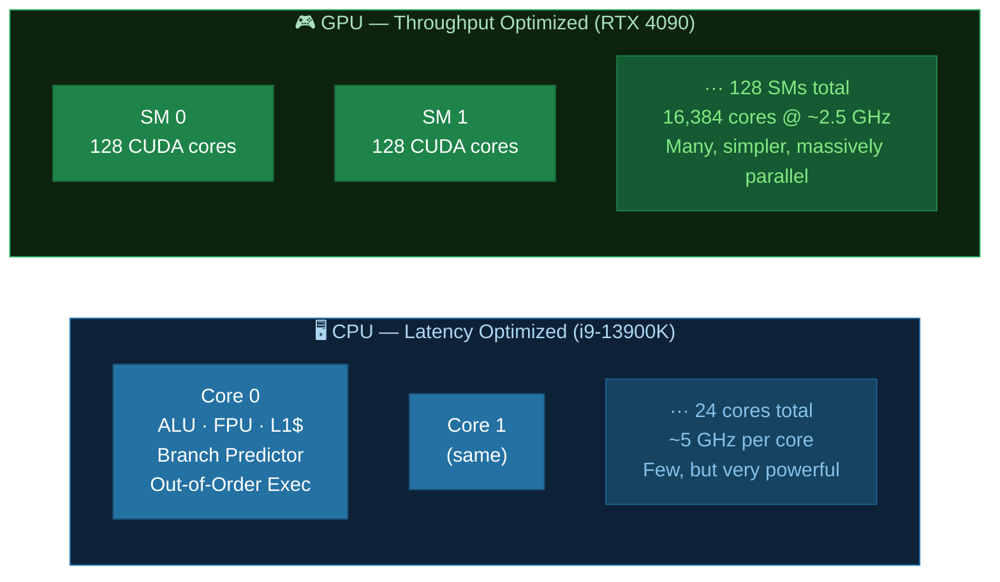
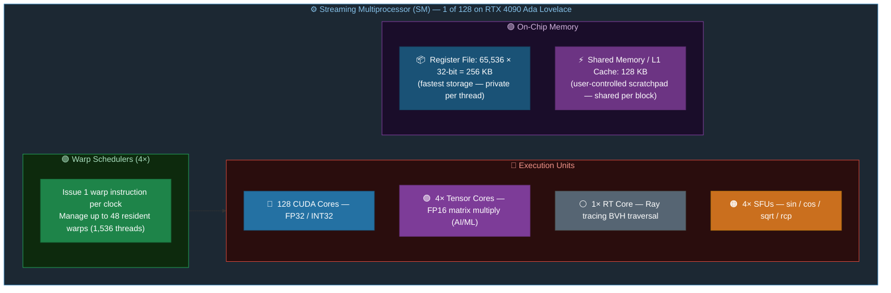
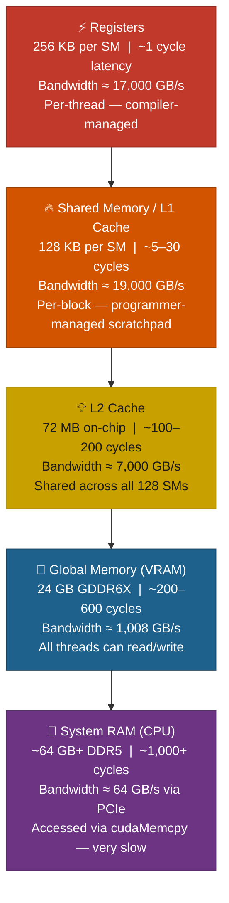
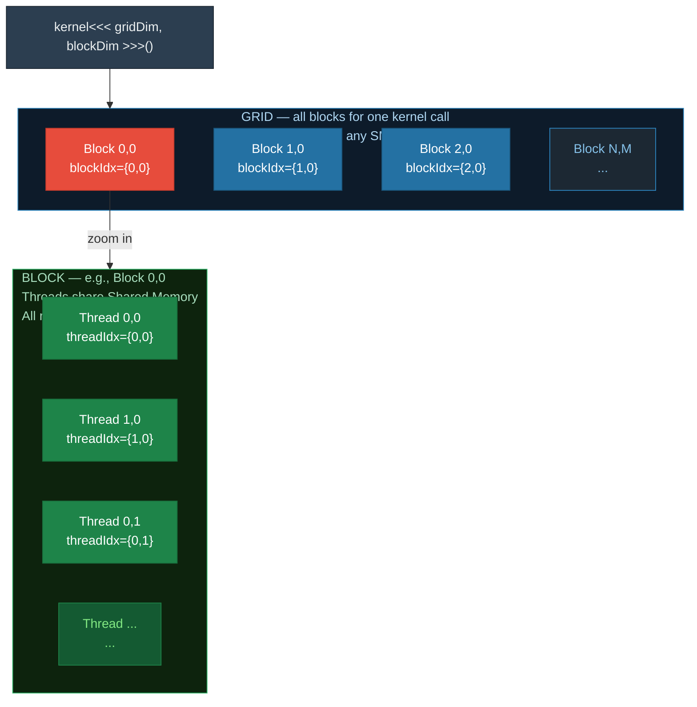
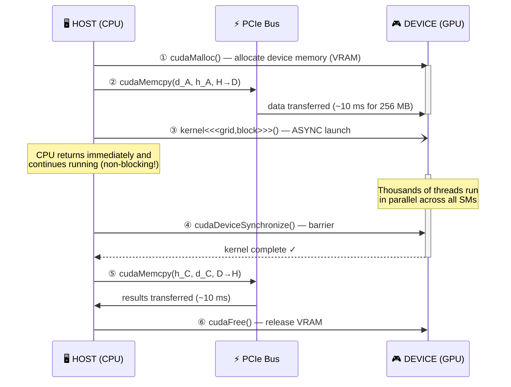
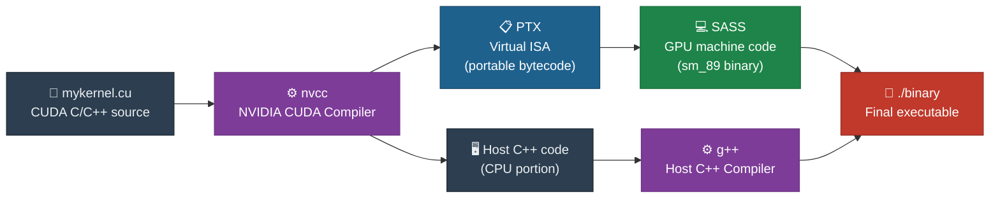
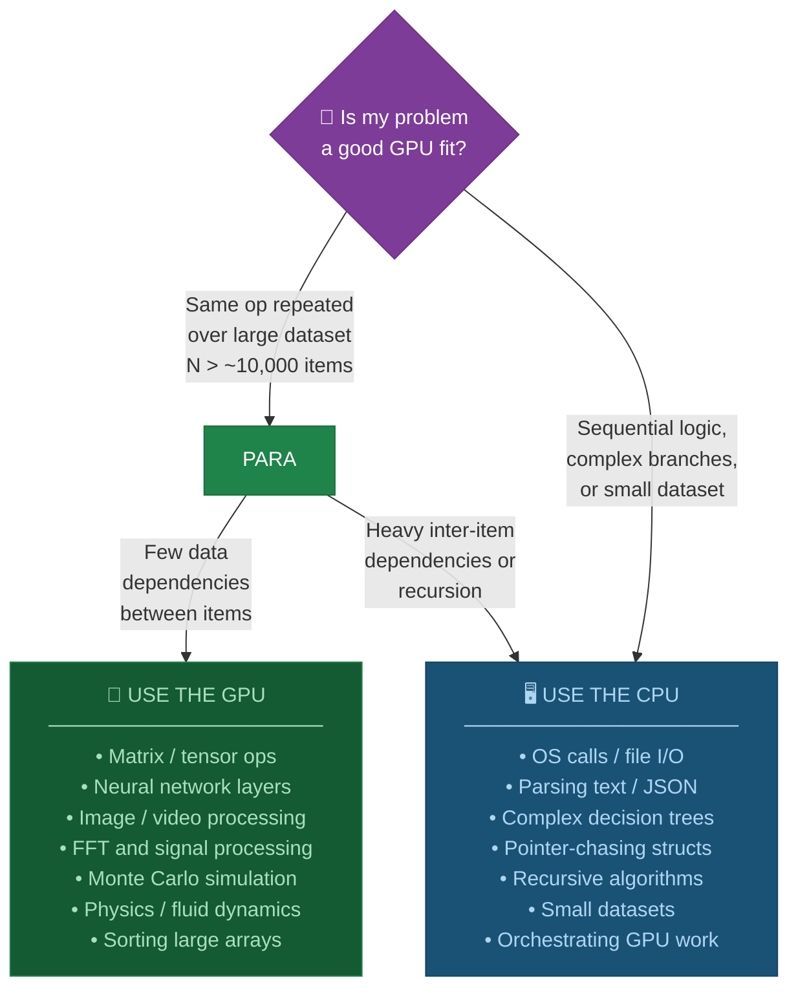

# Chapter 01: GPU Architecture and the CUDA Programming Model

## 1.1 Why GPUs?

Modern CPUs are designed for **latency**: they minimize the time to complete a single task. A CPU has a few powerful cores (typically 8–32), deep out-of-order execution pipelines, large caches, and branch predictors — all aimed at running a single thread as fast as possible.

GPUs are designed for **throughput**: they maximize the total work completed per second. A modern GPU has thousands of smaller, simpler cores. An RTX 4090 has **16,384 CUDA cores**. Each core is weaker than a CPU core, but having thousands of them working in parallel allows the GPU to perform enormous amounts of computation simultaneously.



```
Die area breakdown (approximate):
  CPU: ~50% cache  |  ~30% control logic  |  ~20% compute
  GPU: ~80% compute (ALUs)  |  ~15% memory ctrl  |  ~5% control
```

The key insight: many computational problems — especially in graphics, machine learning, and scientific computing — involve performing the **same operation on large arrays of data**. This is called **data parallelism**, and GPUs exploit it perfectly.

## 1.2 GPU Hardware Architecture

Understanding the hardware hierarchy helps you write efficient CUDA code.

### Streaming Multiprocessors (SMs)

A GPU die is organized into **Streaming Multiprocessors (SMs)**. The RTX 4090 has **128 SMs**.



> 128 SMs × 128 CUDA cores = **16,384 CUDA cores** on the RTX 4090

### The Warp: The Fundamental Execution Unit

The GPU does **not** execute one thread at a time. Threads are grouped into **warps** of 32 threads. All 32 threads in a warp execute the **same instruction simultaneously** — this is called **SIMT** (Single Instruction, Multiple Threads).

When threads within a warp take different paths (branch divergence), the GPU must serialize them, reducing efficiency:

```diff
  ── No Branch Divergence — efficient (all 32 threads take the same path) ──

+ Thread  0:  [instr0][instr1][instr2][instr3][instr4]  ACTIVE  5/5 cycles ✓
+ Thread  1:  [instr0][instr1][instr2][instr3][instr4]  ACTIVE  5/5 cycles ✓
+ Thread  2:  [instr0][instr1][instr2][instr3][instr4]  ACTIVE  5/5 cycles ✓
  ...
+ Thread 31:  [instr0][instr1][instr2][instr3][instr4]  ACTIVE  5/5 cycles ✓

  → 5 cycles total | 100% warp efficiency ✓


  ── Branch Divergence: if (threadIdx.x < 16) { doA(); } else { doB(); } ──

  Pass 1: Branch A executes — threads 16–31 are MASKED (idle)
+ Thread  0:  [A0][A1][A2][A3][──][──][──]  active (branch A)
+ Thread 15:  [A0][A1][A2][A3][──][──][──]  active (branch A)
- Thread 16:  [──][──][──][──][──][──][──]  MASKED — waiting
- Thread 31:  [──][──][──][──][──][──][──]  MASKED — waiting

  Pass 2: Branch B executes — threads 0–15 are MASKED (idle)
- Thread  0:  [──][──][──][──][──][──][──]  MASKED — waiting
- Thread 15:  [──][──][──][──][──][──][──]  MASKED — waiting
+ Thread 16:  [──][──][──][──][B0][B1][B2]  active (branch B)
+ Thread 31:  [──][──][──][──][B0][B1][B2]  active (branch B)

  → 4 + 3 = 7 cycles total | ~57% warp efficiency ✗
  Rule: keep all 32 threads in a warp on the same code path
```

### Memory Hierarchy

The memory system has multiple levels. Moving data to faster memory closer to the compute cores is the primary CUDA optimization strategy.



| Level | Location | Latency | Size | Shared? |
|-------|----------|---------|------|---------|
| Registers | Inside SM | ~1 cycle | 64K per SM | Per-thread |
| Shared Memory | Inside SM | ~5-30 cycles | Up to 100 KB per SM | Per-block |
| L1 Cache | Inside SM | ~20-50 cycles | 128 KB per SM | Per-SM |
| L2 Cache | On-chip | ~100-200 cycles | 72 MB (4090) | All SMs |
| Global Memory | GDDR6X VRAM | ~200-600 cycles | 24 GB (4090) | All threads |
| System RAM | CPU RAM | ~1000+ cycles | As configured | Via PCIe |

## 1.3 CUDA: The Programming Model

CUDA (Compute Unified Device Architecture) is NVIDIA's parallel computing platform. It lets you write C/C++ code that runs on the GPU.

### Key Terminology

| CUDA Term | Hardware Equivalent |
|-----------|-------------------|
| Thread | One CUDA core running one instance of your function |
| Warp | 32 threads executing together (hardware level) |
| Block | User-defined group of threads (share shared memory) |
| Grid | All blocks launched for one kernel call |
| Kernel | A function that runs on the GPU |
| Host | The CPU and its memory |
| Device | The GPU and its memory |

### The Thread Hierarchy



Every thread has a unique identity via:
- `threadIdx.x/y/z` — position within its block
- `blockIdx.x/y/z` — position of the block in the grid
- `blockDim.x/y/z` — size of each block
- `gridDim.x/y/z` — size of the grid

### Concrete Thread Index Calculation

```
Example: 1D grid of 3 blocks, each with 4 threads

Launch: kernel<<<3, 4>>>()        gridDim.x = 3
                                  blockDim.x = 4

Block 0          Block 1          Block 2
┌──┬──┬──┬──┐   ┌──┬──┬──┬──┐   ┌──┬──┬──┬──┐
│T0│T1│T2│T3│   │T0│T1│T2│T3│   │T0│T1│T2│T3│
└──┴──┴──┴──┘   └──┴──┴──┴──┘   └──┴──┴──┴──┘
threadIdx.x:
 0  1  2  3      0  1  2  3      0  1  2  3
blockIdx.x:
 0  0  0  0      1  1  1  1      2  2  2  2

Global index = blockIdx.x * blockDim.x + threadIdx.x
               0*4+0=0             1*4+0=4             2*4+0=8
               0*4+1=1             1*4+1=5             2*4+1=9
               0*4+2=2             1*4+2=6             2*4+2=10
               0*4+3=3             1*4+3=7             2*4+3=11

Array: [A0][A1][A2][A3][A4][A5][A6][A7][A8][A9][A10][A11]
         ▲   ▲   ▲   ▲   ▲   ▲   ▲   ▲   ▲   ▲    ▲    ▲
       T0  T1  T2  T3  T4  T5  T6  T7  T8  T9  T10  T11
```

### A CUDA Program's Execution Flow



## 1.4 Your First CUDA Program

See `01_hello_cuda.cu` — prints from both CPU and GPU threads.

See `02_device_info.cu` — queries and prints detailed GPU hardware information.

## 1.5 Compiling CUDA Code

CUDA source files use the `.cu` extension and are compiled with `nvcc`:

```bash
nvcc -o hello 01_hello_cuda.cu
./hello
```



Common `nvcc` flags:

| Flag | Purpose |
|------|---------|
| `-o <name>` | Output binary name |
| `-arch=sm_89` | Target compute capability (89 = RTX 4090) |
| `-arch=sm_61` | Target CC 6.1 (GTX 1050) |
| `-G` | Enable device-side debugging |
| `-lineinfo` | Embed source line info (for profilers) |
| `-O2` | Optimization level |
| `--use_fast_math` | Use faster (slightly less precise) math ops |

## 1.6 CUDA Error Checking

CUDA API functions return `cudaError_t`. **Always check for errors** — silent failures are the #1 debugging headache in CUDA.

```c
cudaError_t err = cudaMalloc(&d_ptr, size);
if (err != cudaSuccess) {
    fprintf(stderr, "cudaMalloc failed: %s\n", cudaGetErrorString(err));
    exit(1);
}
```

We define a convenient macro `CUDA_CHECK` in our examples:

```c
#define CUDA_CHECK(call)                                               \
    do {                                                               \
        cudaError_t err = (call);                                      \
        if (err != cudaSuccess) {                                      \
            fprintf(stderr, "CUDA error at %s:%d — %s\n",            \
                    __FILE__, __LINE__, cudaGetErrorString(err));      \
            exit(EXIT_FAILURE);                                        \
        }                                                              \
    } while (0)
```

## 1.7 GPU vs CPU: When to Use Each



## 1.8 Exercises

1. Compile and run `01_hello_cuda.cu`. Notice that GPU output order is non-deterministic — why?
2. Compile and run `02_device_info.cu`. Note the warp size, max threads per block, and SM count for your GPU.
3. Modify `01_hello_cuda.cu` to launch 4 blocks of 8 threads each. How many lines of GPU output do you see?
4. Look up the compute capability of your GPU on the [CUDA GPU list](https://developer.nvidia.com/cuda-gpus). What new features does your CC enable?

## 1.9 Key Takeaways

- GPUs have thousands of simple cores optimized for throughput over latency.
- The fundamental hardware unit is the **warp** (32 threads executing in lockstep).
- **Branch divergence** within a warp serializes execution — keep threads on the same code path.
- CUDA organizes threads into a hierarchy: **thread → block → grid**.
- Global thread index: `blockIdx.x * blockDim.x + threadIdx.x`
- Memory is hierarchical: registers → shared memory → L2 → global DRAM.
- Every CUDA program follows: allocate → copy to GPU → kernel launch → sync → copy back → free.
- **Always check CUDA error codes.**
