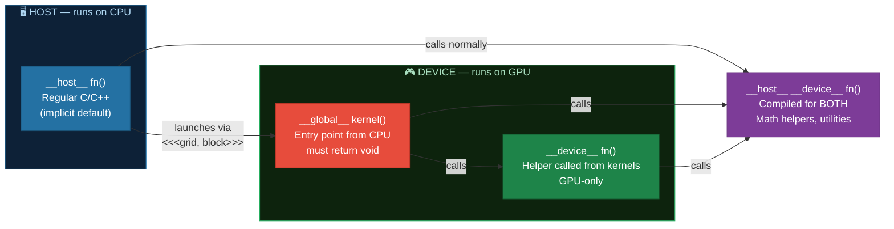
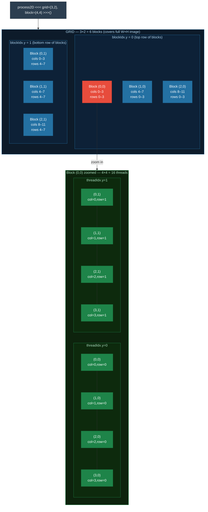
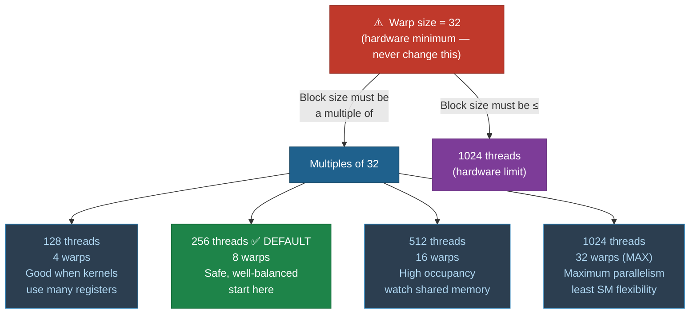
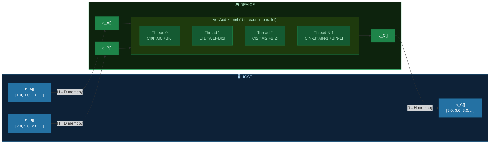
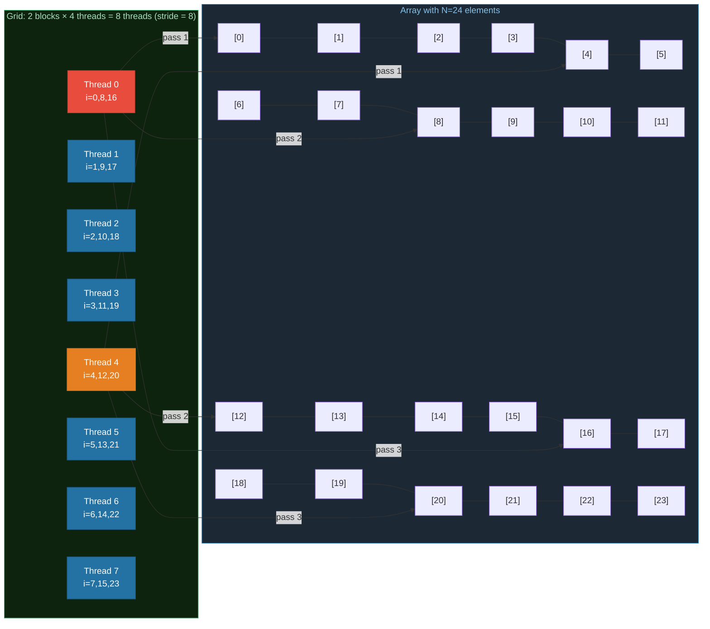
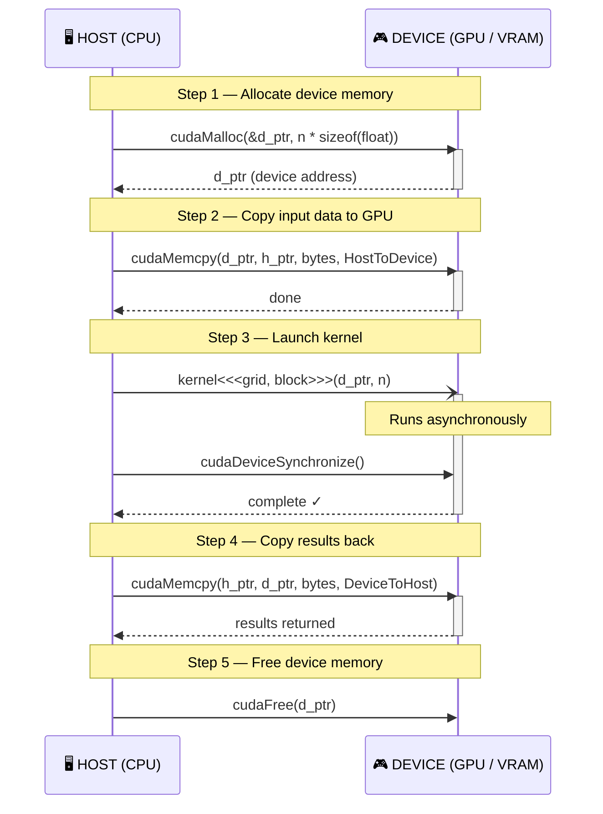

# Chapter 02: The CUDA Programming Model — Kernels, Threads, and Indexing

## 2.1 Writing a Kernel

A **kernel** is a C function decorated with `__global__` that runs on the GPU. When launched, CUDA creates many copies of this function running simultaneously — one per thread.

```c
// A simple kernel that squares each element of an array
__global__ void squareKernel(float *d_out, float *d_in, int n)
{
    int i = blockIdx.x * blockDim.x + threadIdx.x;  // global thread index
    if (i < n)                                        // bounds check!
        d_out[i] = d_in[i] * d_in[i];
}
```

### Function Qualifiers

CUDA adds three qualifiers that control where a function is compiled and who can call it:



| Qualifier | Callable from | Runs on | Notes |
|-----------|--------------|---------|-------|
| `__global__` | Host (CPU) | Device (GPU) | Must return `void`, kernel entry point |
| `__device__` | Device only | Device only | Helper functions called from kernels |
| `__host__` | Host only | Host only | Normal C/C++ (default, rarely needed explicitly) |
| `__host__ __device__` | Both | Both | Compiled for both — useful for math helpers |

## 2.2 Thread Indexing — 1D

The most common pattern maps one thread to one element of an array.

For a 1D kernel launch with `N` elements, the **global thread index** for thread `t` in block `b` with block size `B` is:

```
i = b * B + t
  = blockIdx.x * blockDim.x + threadIdx.x
```

### Why Bounds Checking Matters

The number of threads launched is always rounded up to a full block. The last block often has threads that map beyond the array end:

```diff
  kernel<<<3, 4>>>()  →  12 threads total,  but N = 10 elements

+ Thread  0  (i= 0):  d_out[0]  = d_in[0]  * d_in[0]   ✓ in bounds
+ Thread  1  (i= 1):  d_out[1]  = d_in[1]  * d_in[1]   ✓ in bounds
+ Thread  2  (i= 2):  d_out[2]  = d_in[2]  * d_in[2]   ✓ in bounds
+ Thread  3  (i= 3):  d_out[3]  = d_in[3]  * d_in[3]   ✓ in bounds
+ Thread  4  (i= 4):  d_out[4]  = d_in[4]  * d_in[4]   ✓ in bounds
+ Thread  5  (i= 5):  d_out[5]  = d_in[5]  * d_in[5]   ✓ in bounds
+ Thread  6  (i= 6):  d_out[6]  = d_in[6]  * d_in[6]   ✓ in bounds
+ Thread  7  (i= 7):  d_out[7]  = d_in[7]  * d_in[7]   ✓ in bounds
+ Thread  8  (i= 8):  d_out[8]  = d_in[8]  * d_in[8]   ✓ in bounds
+ Thread  9  (i= 9):  d_out[9]  = d_in[9]  * d_in[9]   ✓ in bounds
- Thread 10  (i=10):  d_out[10] = ???  OUT OF BOUNDS — memory corruption! 🔥
- Thread 11  (i=11):  d_out[11] = ???  OUT OF BOUNDS — memory corruption! 🔥

  Guard with:  if (i < n)  ← skips threads 10 and 11 safely ✓
```

## 2.3 Thread Indexing — 2D

For 2D data (images, matrices), use 2D grids and blocks. Each thread computes `(col, row)` coordinates:

```c
// 2D kernel — process a W x H image
__global__ void process2D(float *data, int width, int height)
{
    int col = blockIdx.x * blockDim.x + threadIdx.x;  // x-coordinate
    int row = blockIdx.y * blockDim.y + threadIdx.y;  // y-coordinate

    if (col < width && row < height) {
        int idx = row * width + col;  // row-major linearization
        data[idx] *= 2.0f;
    }
}
```

Launch with a 2D block and grid:
```c
dim3 block(16, 16);           // 16x16 = 256 threads per block
dim3 grid((W + 15) / 16,      // ceil(W/16) blocks in x
          (H + 15) / 16);     // ceil(H/16) blocks in y
process2D<<<grid, block>>>(d_data, W, H);
```

### 2D Grid / Block Layout



The `dim3` type is a struct with `.x`, `.y`, `.z` fields (default `.z = 1`).

## 2.4 Choosing Block Size

Block size is one of the most important tuning parameters.



Rules:
1. Block size must be a **multiple of 32** (the warp size). Non-multiples waste hardware.
2. Common choices: **128, 256, 512** (256 is a safe default).
3. Max threads per block is typically **1024**.
4. Larger blocks share more shared memory but limit the number of blocks per SM.

For 2D blocks: 16×16 = 256 and 32×32 = 1024 are both common.

## 2.5 The Vector Addition Example

Vector addition is the "Hello, World!" of GPU computing:



Properties that make it ideal for learning:
- **Perfectly parallel** — each element `C[i]` is fully independent
- **Memory-bound** — most time is spent on memory, not computation (arithmetic intensity ≈ 0.17 FLOP/byte)
- Simple enough to focus on the CUDA mechanics

See `01_vector_add.cu` for the full, commented example with timing.

## 2.6 Thread ID Patterns — Summary

```c
// 1D grid, 1D blocks
int i = blockIdx.x * blockDim.x + threadIdx.x;

// 2D grid, 2D blocks
int col = blockIdx.x * blockDim.x + threadIdx.x;
int row = blockIdx.y * blockDim.y + threadIdx.y;
int i   = row * width + col;

// 3D grid, 3D blocks (for volumetric data)
int x = blockIdx.x * blockDim.x + threadIdx.x;
int y = blockIdx.y * blockDim.y + threadIdx.y;
int z = blockIdx.z * blockDim.z + threadIdx.z;
int i = z * (width * height) + y * width + x;

// 1D grid but operating on 2D data via striding
int tid = blockIdx.x * blockDim.x + threadIdx.x;
int stride = gridDim.x * blockDim.x;
for (int i = tid; i < n; i += stride) { ... }  // grid-stride loop
```

### The Grid-Stride Loop

The grid-stride loop is a robust pattern when the grid may be smaller than the data size. Each thread processes multiple elements by stepping by the total grid width:



The grid-stride loop is also more friendly to compiler optimizations and works correctly regardless of how large `N` is relative to the grid.

## 2.7 Memory Management



```c
float *d_ptr;                           // device pointer (prefix d_ by convention)
cudaMalloc(&d_ptr, n * sizeof(float));  // allocate on GPU

// cudaMemcpy(dst, src, bytes, direction)
cudaMemcpy(d_ptr, h_ptr, n * sizeof(float), cudaMemcpyHostToDevice);   // CPU → GPU
cudaMemcpy(h_ptr, d_ptr, n * sizeof(float), cudaMemcpyDeviceToHost);   // GPU → CPU

cudaFree(d_ptr);                        // free GPU memory
```

## 2.8 Exercises

1. Modify `01_vector_add.cu` to compute `C[i] = A[i] * A[i] + B[i] * B[i]` (element-wise squared norm).
2. In `02_thread_indexing.cu`, change the block size from 256 to 128 and 512. Does the output change? Does timing change?
3. Write a kernel that computes the element-wise product of two vectors (Hadamard product).
4. In `02_thread_indexing.cu`, modify it to transpose a matrix: `out[col][row] = in[row][col]`. Run it — is it correct? (Hint: transposition is tricky, we'll optimize it in Chapter 03.)
5. What happens if you launch a kernel with 0 blocks? What about 0 threads per block? Try it.

## 2.9 Key Takeaways

- Kernels are launched with `<<<numBlocks, threadsPerBlock>>>` syntax.
- Use `blockIdx`, `blockDim`, and `threadIdx` to compute each thread's unique global index.
- **Always bounds-check**: the total thread count may exceed your data size.
- Block size should be a **multiple of 32**; 256 is a safe default.
- The **grid-stride loop** pattern handles arbitrary data sizes robustly.
- `cudaMalloc` / `cudaMemcpy` / `cudaFree` are the three fundamental memory operations.
