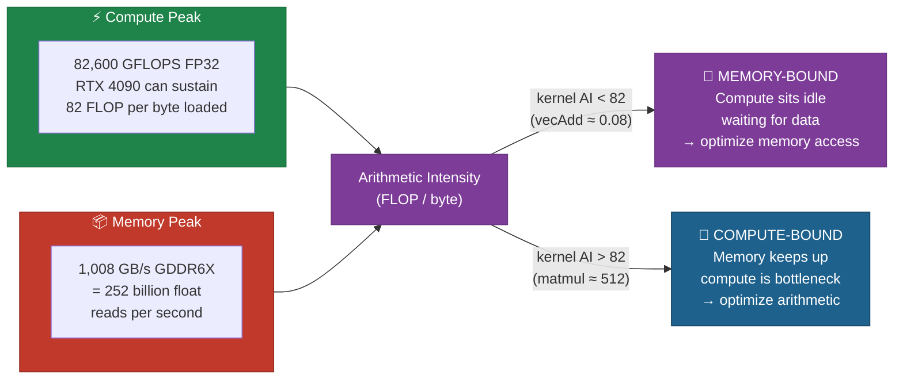
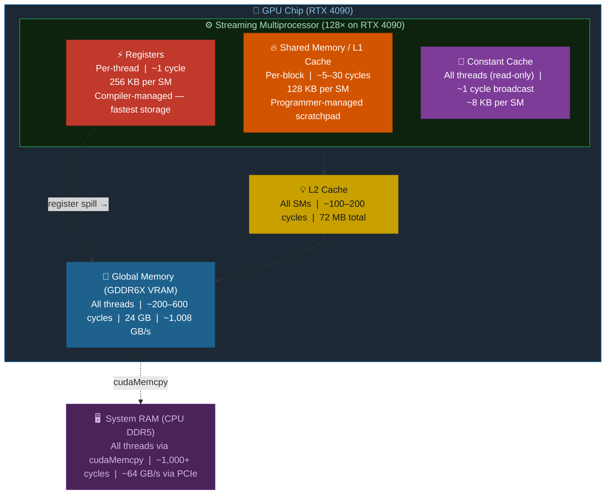
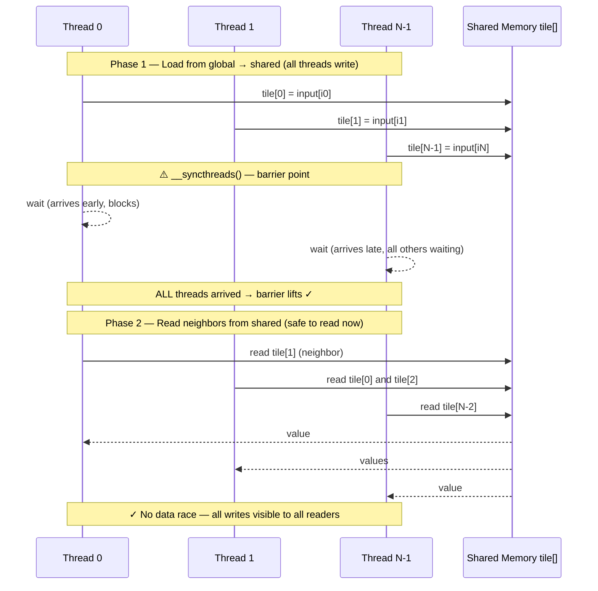
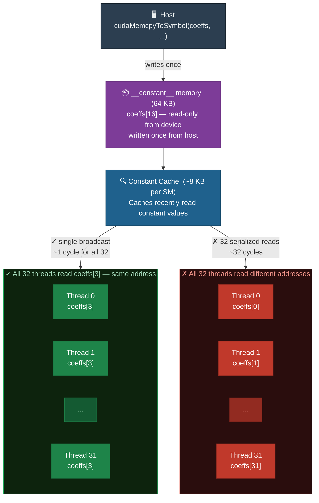
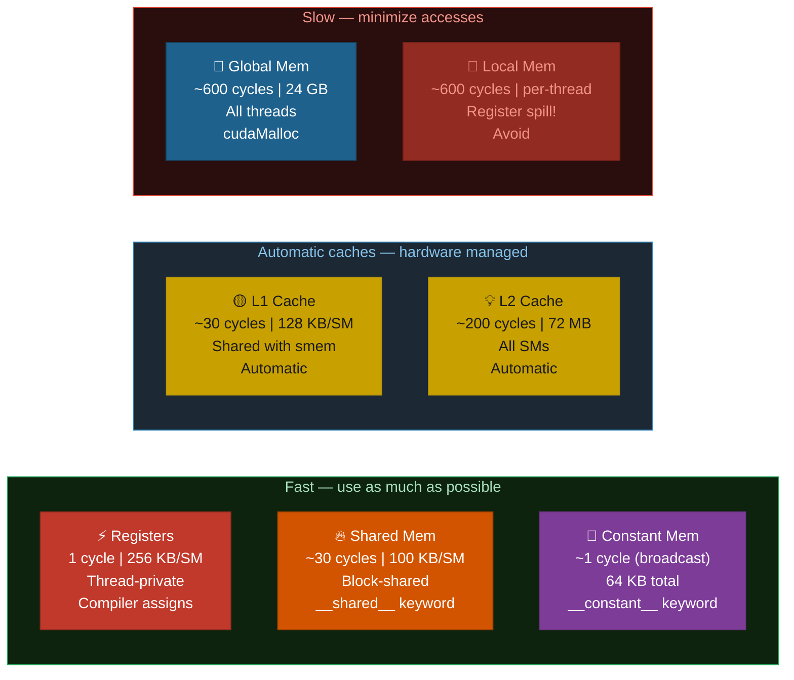

# Chapter 03: The CUDA Memory Hierarchy

## 3.1 Why Memory Matters More Than Compute

On modern GPUs, arithmetic operations are extremely cheap. An RTX 4090 can perform over 80 **trillion** floating-point operations per second (TFLOPS). But it can only move ~1 TB/s of data from global DRAM.

Consider vector addition (`C = A + B`):
- 3 memory operations (read A, read B, write C) per 1 add
- At 1 TB/s and 4 bytes/float: 250 billion reads/writes per second
- At 1 add per 3 ops: ~83 billion adds per second = ~0.1% of peak compute!

**Most real CUDA programs are memory-bound.** Understanding the memory hierarchy is how you unlock GPU performance.

### The Roofline: Compute vs. Memory Bandwidth



## 3.2 Memory Types Overview



## 3.3 Registers

- **Scope**: Per-thread (completely private)
- **Latency**: ~1 cycle
- **Size**: ~65,536 registers per SM (each 32-bit)
- **Management**: Automatic — compiler assigns variables to registers

Registers are the fastest storage. Local variables in a kernel live here.

```c
__global__ void kernel(float *data, int n)
{
    float temp = data[blockIdx.x];  // 'temp' lives in a register
    temp = temp * temp + 1.0f;      // register arithmetic — ~1 cycle
    data[blockIdx.x] = temp;
}
```

**Register pressure**: if a kernel uses too many registers, the compiler "spills" them to slow **local memory** (global DRAM with per-thread addressing). Avoid this.

## 3.4 Global Memory

- **Scope**: All threads, entire program lifetime
- **Latency**: ~200–600 cycles
- **Bandwidth**: ~1 TB/s (RTX 4090)
- **Declaration**: `cudaMalloc` / `cudaMallocManaged`

Global memory is large but slow. The critical optimization is **memory coalescing**.

### Memory Coalescing

When threads in a warp access global memory, the hardware combines (coalesces) adjacent accesses into fewer, wider transactions. A full warp of 32 threads ideally issues a single 128-byte transaction.

```diff
  ── Pattern 1: Coalesced — thread i reads data[i]  ──────────────────────────

+ Thread  0: data[ 0] → addr 0x0000  ┐
+ Thread  1: data[ 1] → addr 0x0004  │  contiguous addresses
+ Thread  2: data[ 2] → addr 0x0008  │
+ Thread  3: data[ 3] → addr 0x000C  │
+ ...                                 │
+ Thread 31: data[31] → addr 0x007C  ┘
+ → 1 × 128-byte transaction for the whole warp  |  100% efficiency ✓


  ── Pattern 2: Strided — thread i reads data[i * 2]  ────────────────────────

  Thread  0: data[ 0] → addr 0x0000  ┐
  Thread  1: data[ 2] → addr 0x0008  │  gaps between accesses
  Thread  2: data[ 4] → addr 0x0010  │  (every other element skipped)
  ...                                 │
  Thread 31: data[62] → addr 0x00F8  ┘
  → 2 × 128-byte transactions  |  50% wasted (unused elements loaded)


  ── Pattern 3: Random — thread i reads data[rand_idx[i]]  ───────────────────

- Thread  0: data[47]  → addr 0x00BC  ┐
- Thread  1: data[ 3]  → addr 0x000C  │  scattered across memory
- Thread  2: data[211] → addr 0x034C  │
- Thread  3: data[ 88] → addr 0x0160  │
- ...                                  │
- Thread 31: data[512] → addr 0x0800  ┘
- → up to 32 separate transactions  |  ~3% efficiency ✗
```

**Always arrange your data and access patterns to be coalesced.**

## 3.5 Shared Memory

- **Scope**: All threads within the same **block** (shared by the block)
- **Latency**: ~5–30 cycles (on-chip)
- **Size**: Up to 100 KB per SM (configurable)
- **Declaration**: `__shared__` keyword

Shared memory is a programmer-controlled cache. Use it when:
- Multiple threads in a block access the same data (reuse)
- You want to reorganize non-coalesced accesses into coalesced ones

```c
__global__ void sharedExample(float *input, float *output, int n)
{
    // Static shared memory declaration (size known at compile time)
    __shared__ float tile[256];

    int i = blockIdx.x * blockDim.x + threadIdx.x;

    // Load from slow global memory into fast shared memory
    if (i < n)
        tile[threadIdx.x] = input[i];

    // Synchronize: ALL threads in the block must reach here before any continue
    __syncthreads();

    // Now threads can read each other's values from tile[]
    // e.g., thread i reads its neighbor's value
    if (i < n && threadIdx.x > 0)
        output[i] = (tile[threadIdx.x] + tile[threadIdx.x - 1]) / 2.0f;
}
```

### The `__syncthreads()` Barrier

`__syncthreads()` is a **barrier**: every thread in the block must reach it before any thread proceeds. This prevents data races where one thread reads before another has written.



### Dynamic Shared Memory

When the size is unknown at compile time:

```c
// Kernel declaration
__global__ void myKernel(float *data, int n)
{
    extern __shared__ float smem[];  // size specified at launch
    // ...
}

// Launch with dynamic shared memory size as 3rd config parameter
myKernel<<<grid, block, sharedMemBytes>>>(data, n);
```

### Shared Memory Bank Conflicts

Shared memory is organized into 32 **banks** (for 4-byte words). If multiple threads in a warp access the same bank simultaneously, accesses are serialized — a **bank conflict**.

```diff
  Shared memory layout:  Bank = address % 32
  Banks:  [0] [1] [2] [3] ... [31] [0] [1] [2] ... (wraps every 32 words)
  Addrs:   0   1   2   3  ...  31   32  33  34  ...


  ── ✓ No Conflict: tile[threadIdx.x]  ─────────────────────────────────────

+ Thread  0 → tile[ 0] → Bank  0   ✓ unique bank
+ Thread  1 → tile[ 1] → Bank  1   ✓ unique bank
+ Thread  2 → tile[ 2] → Bank  2   ✓ unique bank
+ ...
+ Thread 31 → tile[31] → Bank 31   ✓ unique bank
+ → All 32 banks busy in parallel — 1 cycle ✓


  ── ✗ 2-Way Conflict: tile[threadIdx.x * 2]  ──────────────────────────────

- Thread  0 → tile[ 0] → Bank  0  ┐ CONFLICT: two threads
- Thread 16 → tile[32] → Bank  0  ┘ hit same bank → serialized
- Thread  1 → tile[ 2] → Bank  2  ┐ CONFLICT
- Thread 17 → tile[34] → Bank  2  ┘ same bank → serialized
- ...
- → 2 serialized passes — 2× slower ✗


  ── ✗ 32-Way Conflict: tile[0] (all write same addr, not broadcast)  ───────

- All 32 threads → tile[0] → Bank 0  → fully serialized: 32× slower ✗
  (Exception: reading the same address IS a free broadcast ✓)
```

See `02_shared_memory.cu` for a demonstration.

## 3.6 Constant Memory

- **Scope**: All threads (read-only from device, writable from host)
- **Latency**: ~1 cycle if all threads read the **same** address (broadcast)
- **Size**: 64 KB total (hardware-limited)
- **Declaration**: `__constant__` keyword (at file scope)

Perfect for read-only data used uniformly across all threads (filter kernels, lookup tables, physics constants).

```c
__constant__ float coeffs[16];  // at file scope

// Host sets it via:
cudaMemcpyToSymbol(coeffs, h_coeffs, 16 * sizeof(float));

// Device reads it normally:
__global__ void filter(float *data, int n)
{
    // All threads read coeffs[3] simultaneously → single broadcast, 0 latency
    float c = coeffs[3];
    // ...
}
```

### Constant Memory Broadcast vs. Serialization



**Key constraint**: if different threads access different constant memory addresses simultaneously, accesses are serialized — you lose the benefit. Use it only when all threads need the same value.

## 3.7 Local Memory

- **Scope**: Per-thread (private)
- **Physically**: Part of global DRAM (slow!)
- **Used**: When registers spill, or for large per-thread arrays

Local memory is a misnomer — it's not fast local memory, it's just private global memory. Avoid it.

```c
__global__ void careful(int n)
{
    int bigArray[100];  // DANGER: this may go to local memory!
    // ...
}
```

## 3.8 Memory Usage Summary



| Memory | Scope | Latency | Size | Notes |
|--------|-------|---------|------|-------|
| Registers | Thread | 1 cycle | 256 KB/SM | Fast, limited |
| Shared | Block | ~30 cycles | 100 KB/SM | Programmer-managed L1 |
| L1 Cache | SM | ~30 cycles | 128 KB/SM | Automatic, shared with smem |
| Constant | All threads | ~1 cycle (broadcast) | 64 KB | Read-only, all-same-address |
| Texture | All threads | ~30 cycles | Backed by L2 | Spatial locality, read-only |
| L2 Cache | All SMs | ~200 cycles | 72 MB (4090) | Automatic |
| Global | All threads | ~600 cycles | 24 GB (4090) | Main VRAM |

## 3.9 Exercises

1. In `01_global_memory.cu`, change the access pattern to strided. Use `nvprof` or Nsight to observe the drop in effective bandwidth.
2. In `02_shared_memory.cu`, intentionally create a bank conflict by changing the access stride. Measure the performance difference.
3. Implement a 1D convolution using constant memory for the filter coefficients. Compare with using global memory for the filter.
4. What is the maximum number of 32-bit registers per thread? (Hint: each SM has 65,536 registers and max 2048 threads.)

## 3.10 Key Takeaways

- Most CUDA kernels are **memory-bound** — optimize memory access before worrying about arithmetic.
- **Coalesced global memory access** is the most impactful single optimization.
- **Shared memory** is a fast programmer-managed cache; use it to stage data for reuse.
- `__syncthreads()` is required after writes to shared memory before others read.
- **Constant memory** provides free broadcast for uniform read-only data.
- Avoid register spills to local memory (watch for large per-thread arrays).
