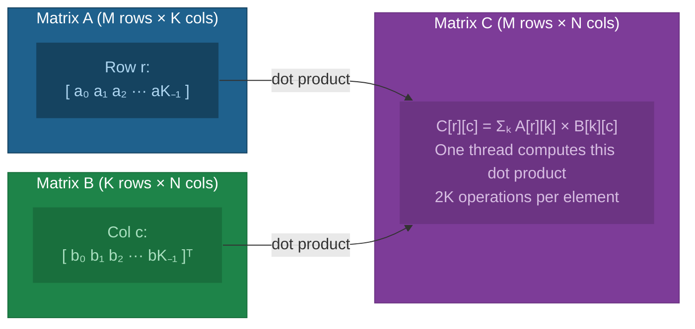
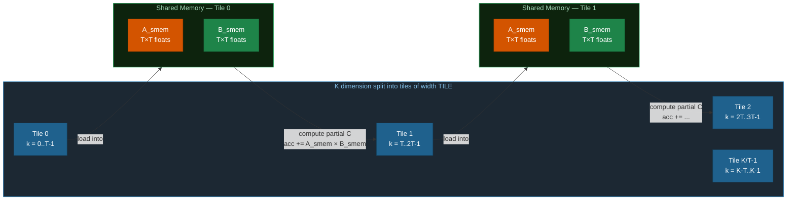
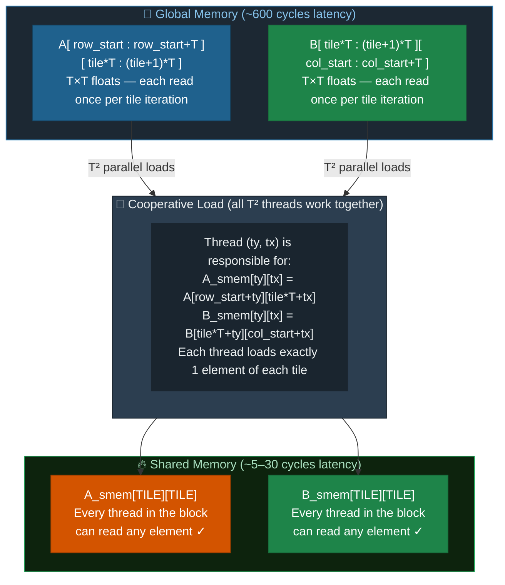
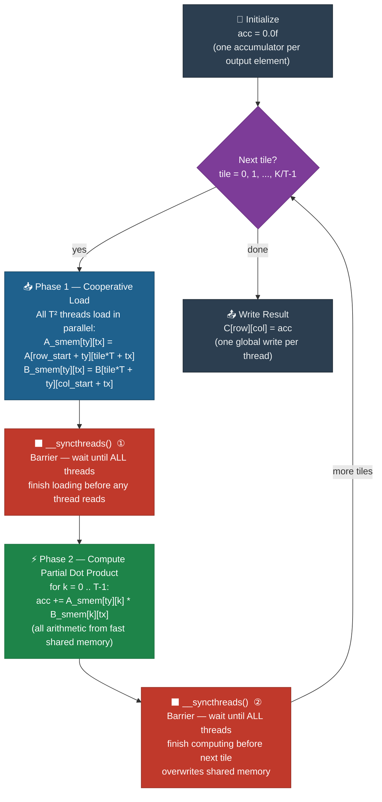
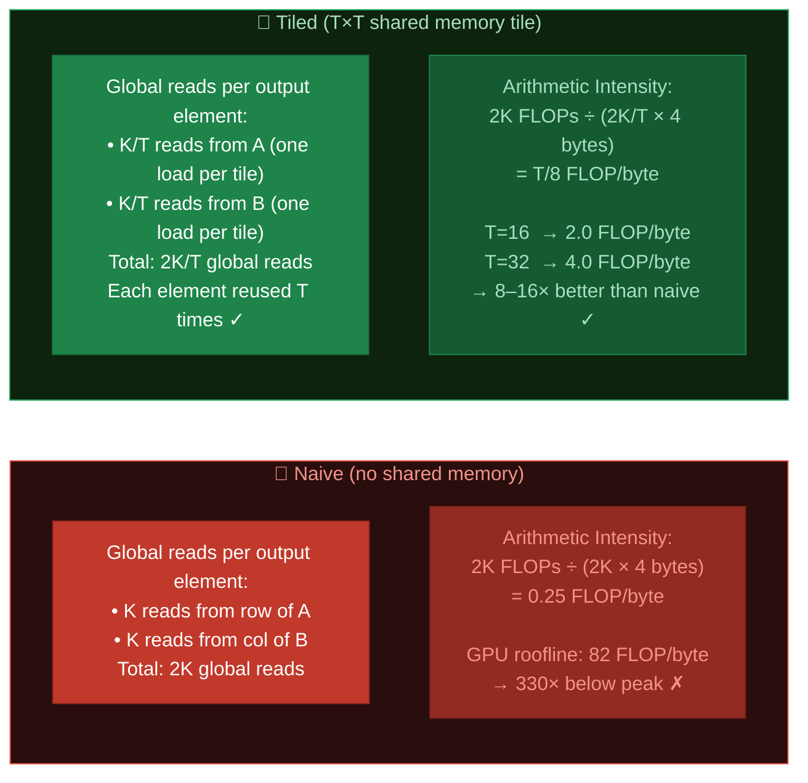
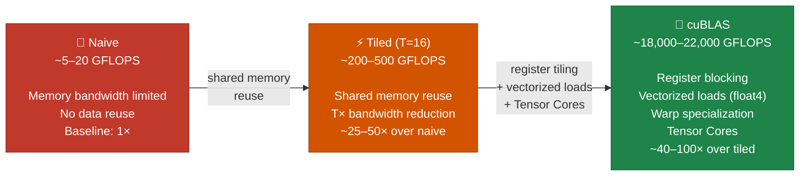
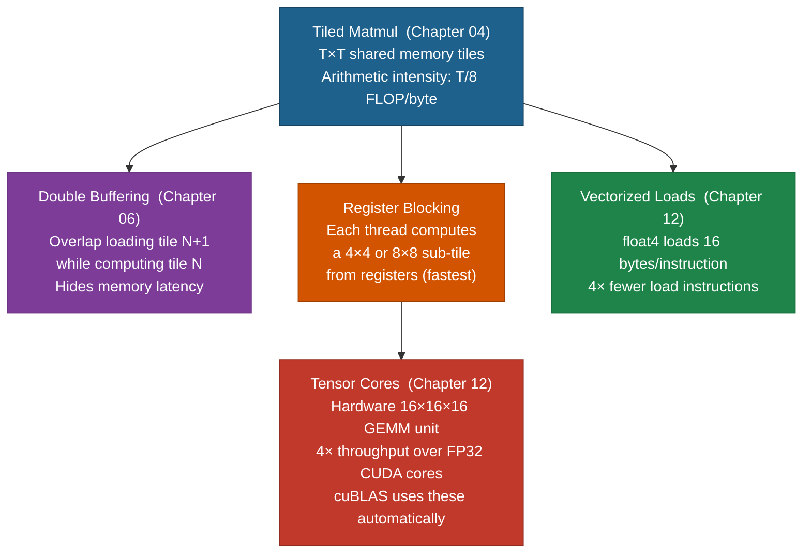

# Chapter 04: Tiled Matrix Multiplication — Shared Memory in Practice

## 4.1 The Classic GPU Benchmark

Matrix multiplication (`C = A × B`) is the most important kernel in GPU computing. It is:
- The backbone of deep learning (every linear layer = GEMM)
- The canonical example for teaching shared memory optimization
- Used to benchmark GPU performance (GFLOPS/s)



For matrices A (M×K) and B (K×N), each element of C is a dot product:
```
C[row][col] = Σ A[row][k] * B[k][col]  for k = 0..K-1
```

Total operations: **M × N × 2K** (K multiplications + K additions per output element).

## 4.2 Naive Matrix Multiplication

The straightforward approach: one thread computes one element of C.

```c
__global__ void matmulNaive(float *A, float *B, float *C, int M, int N, int K)
{
    int row = blockIdx.y * blockDim.y + threadIdx.y;
    int col = blockIdx.x * blockDim.x + threadIdx.x;

    if (row < M && col < N) {
        float sum = 0.0f;
        for (int k = 0; k < K; k++)
            sum += A[row * K + k] * B[k * N + col];
        C[row * N + col] = sum;
    }
}
```

### The Data Reuse Problem

The naive kernel loads every value from global memory independently — zero cooperation between threads, zero reuse:

```diff
  Naive kernel — warp of 32 threads computing C[row][0..31]
  Each thread independently loads K values of A and K values of B

  Thread 0 computes C[row][0]:
- Loads A[row][0], A[row][1], ..., A[row][K-1]  from global mem  (K reads)
- Loads B[0][0],   B[1][0],   ..., B[K-1][0]    from global mem  (K reads)

  Thread 1 computes C[row][1]:
- Loads A[row][0], A[row][1], ..., A[row][K-1]  from global mem  (K reads) ← SAME as Thread 0!
- Loads B[0][1],   B[1][1],   ..., B[K-1][1]    from global mem  (K reads)

  Thread 2 computes C[row][2]:
- Loads A[row][0], A[row][1], ..., A[row][K-1]  from global mem  (K reads) ← SAME again!
- Loads B[0][2],   B[1][2],   ..., B[K-1][2]    from global mem  (K reads)
  ...
  Thread 31 computes C[row][31]:
- Loads A[row][0..K-1] from global mem  ← 32nd redundant copy of row r of A ✗
- Loads B[0..K-1][31]  from global mem

  Total global reads for this warp: 32 × 2K = 64K  (should be: 32K + K = 33K)
  Wasted bandwidth: ~49%  |  Arithmetic intensity: ~0.25 FLOP/byte ✗
```

## 4.3 Tiled Matrix Multiplication

The solution: load tiles of A and B into shared memory, then compute from fast on-chip memory. All threads in the block **share** the loaded tile — K reads become K/TILE reads.

### The Tiling Idea

Instead of computing the full dot product in one pass, break the K dimension into **tiles of width TILE**:



Key insight: **memory traffic is reduced by a factor of TILE**.
- Without tiling: each thread loads K elements of A and K elements of B independently
- With tiling: the block of TILE² threads loads each tile **once** and every element is reused TILE times

### Cooperative Tile Loading



## 4.4 The Tiled Algorithm Step-by-Step



**Two `__syncthreads()` calls per tile iteration** are required:
1. **After loading** — prevents any thread from reading `A_smem`/`B_smem` before all threads have written their element
2. **After computing** — prevents any thread from overwriting `A_smem`/`B_smem` with the next tile's data before all threads have finished reading this tile

## 4.5 Arithmetic Intensity: Naive vs. Tiled



## 4.6 Benchmarking Matrix Multiply

For a 2048×2048 float32 matrix multiply (~17.2 GFLOP total):



The gap between tiled and cuBLAS represents further optimizations we'll see in later chapters: register tiling, vectorized loads, software pipelining, warp specialization.

## 4.7 Beyond Basic Tiling



See `01_matmul_naive.cu` and `02_matmul_tiled.cu`.

## 4.8 Exercises

1. Run the naive vs tiled benchmarks. Calculate the achieved GFLOPS for each.
2. Experiment with different `TILE` sizes (8, 16, 32). How does performance change? Why might 32 be slower than 16 despite more reuse?
3. What happens if K is not a multiple of TILE? Look at how boundary conditions are handled in the code.
4. The tiled kernel still has non-coalesced access for one of the matrices. Which one? How would you fix it? (Hint: think about how B_smem is loaded.)
5. Implement a version that verifies against a CPU reference for a small matrix (e.g., 64×64).

## 4.9 Key Takeaways

- Matrix multiply is the canonical shared memory optimization problem.
- **Tiling** reduces global memory traffic by factor TILE (dramatically improves arithmetic intensity).
- Threads in a block **cooperate** to load a tile: thread `(ty, tx)` loads element `[ty][tx]` of the tile.
- Both `__syncthreads()` calls (after load and after compute) are **required**.
- A tile size of 16 is common (16×16 = 256 threads, fits within shared memory limits).
- Even optimized tiled code is still far below cuBLAS — many more tricks exist.
