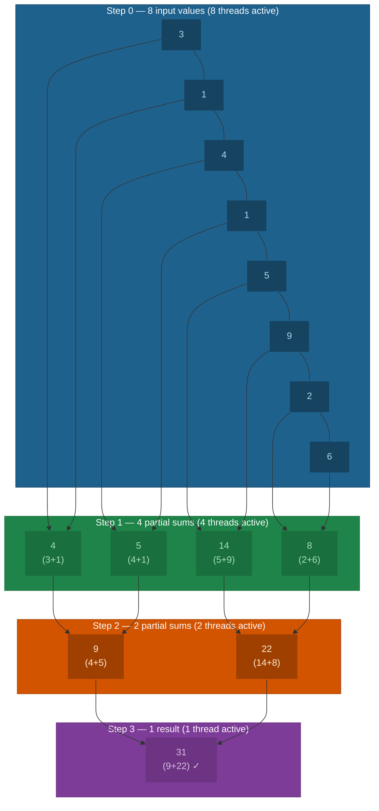
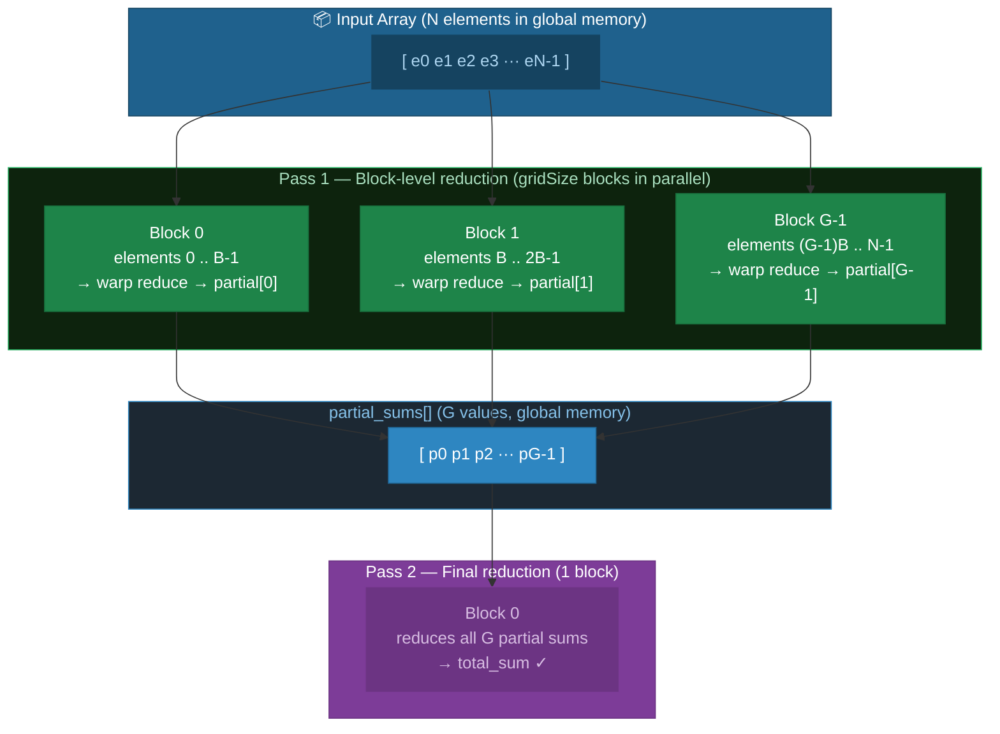
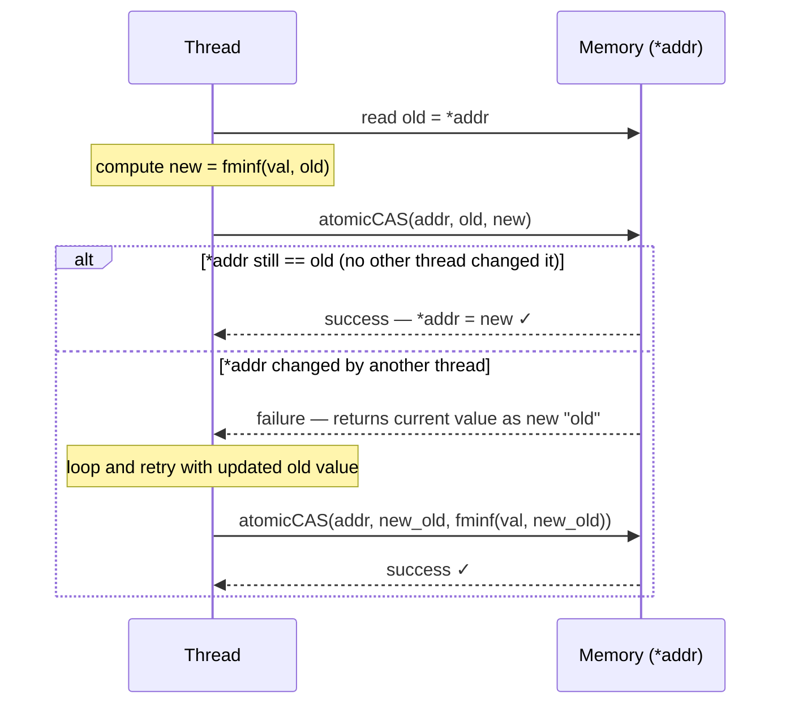
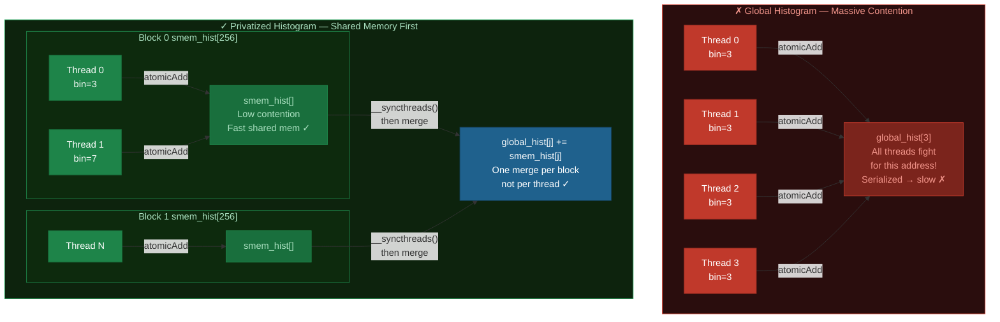

# Chapter 05: Parallel Reduction and Atomic Operations

## 5.1 What is a Reduction?

A **reduction** collapses an array of N values into a single value using an associative operator (sum, max, min, product, etc.):

```
Input:  [3, 1, 4, 1, 5, 9, 2, 6]
Output: 31  (sum)
```

On the CPU this is trivial — a single loop. On the GPU, doing it with one thread wastes all the parallelism. We need a parallel algorithm.

## 5.2 The Parallel Reduction Tree

The key insight: split the work recursively. At each step, half the threads compute pairwise sums. After log₂(N) steps, a single value remains.



This runs in **O(log₂N)** steps instead of O(N) — using O(N) total work across all steps.

## 5.3 Naive Reduction: Interleaved Addressing (Divergent)

```c
// BAD: interleaved stride causes warp divergence
__global__ void reduceInterleaved(float *data, int n)
{
    int tid = threadIdx.x;
    // Stride doubles each step
    for (int stride = 1; stride < blockDim.x; stride *= 2) {
        if (tid % (2 * stride) == 0)       // ← divergence! half threads idle
            data[tid] += data[tid + stride];
        __syncthreads();
    }
}
```

## 5.4 Better: Sequential Addressing (No Divergence)

```c
// GOOD: sequential addressing — no warp divergence
__global__ void reduceSequential(float *data, int n)
{
    int tid = threadIdx.x;
    // Stride halves each step, threads at the low end stay active
    for (int stride = blockDim.x / 2; stride > 0; stride >>= 1) {
        if (tid < stride)                  // ← contiguous threads active
            data[tid] += data[tid + stride];
        __syncthreads();
    }
}
```

### Interleaved vs. Sequential: Warp Divergence Comparison

```diff
  ── Interleaved Addressing (BAD) ──────────────────────────────────────────
  Active condition: tid % (2 * stride) == 0

  stride=1:  active threads = 0, 2, 4, 6, 8, ... 30  (every other thread)
- Warp 0: [T0✓][T1✗][T2✓][T3✗][T4✓][T5✗]...[T30✓][T31✗]  ← 50% divergence ✗

  stride=2:  active threads = 0, 4, 8, 12, ...
- Warp 0: [T0✓][T1✗][T2✗][T3✗][T4✓][T5✗][T6✗][T7✗]...    ← 75% divergence ✗

  stride=4:  active threads = 0, 8, 16, 24
- Warp 0: [T0✓][T1-T7✗][T8✓][T9-T15✗]...                   ← 87% divergence ✗

  All warps contain a mix of active and idle threads → serialized execution ✗


  ── Sequential Addressing (GOOD) ─────────────────────────────────────────
  Active condition: tid < stride

  stride=128: threads 0-127 active, threads 128-255 idle
+ Warps 0-3: [T0..T127] FULLY ACTIVE  ✓
  Warps 4-7: [T128..T255] fully idle  (complete warps — zero divergence)

  stride=64:  threads 0-63 active
+ Warps 0-1: [T0..T63] FULLY ACTIVE  ✓
  Warps 2-7: fully idle

  stride=32:  threads 0-31 active
+ Warp 0:    [T0..T31] FULLY ACTIVE  ✓  (use warp shuffle from here!)
  Warps 1-7: fully idle

  Active warps are always fully utilized — no divergence within any warp ✓
```

## 5.5 Warp-Level Reduction with Shuffle Instructions

For the final 32 elements (one warp), we can skip shared memory entirely using `__shfl_down_sync`:

```c
// Warp-level reduce: all 32 threads cooperate, result in lane 0
__device__ float warpReduceSum(float val)
{
    unsigned mask = 0xffffffff;  // All 32 threads participate
    for (int offset = 16; offset > 0; offset >>= 1)
        val += __shfl_down_sync(mask, val, offset);
    return val;  // Only lane 0 has the final sum
}
```

`__shfl_down_sync(mask, val, offset)`: thread `i` receives the value from thread `i + offset` — **no shared memory, no synchronization barrier required**.

```diff
  __shfl_down_sync — 8-lane example (full warp is 32 lanes)

  Start:
+ Lane 0:3   Lane 1:1   Lane 2:4   Lane 3:1   Lane 4:5   Lane 5:9   Lane 6:2   Lane 7:6

  offset=4  →  lane i reads from lane i+4  (lane i += lane i+4)
+ Lane 0: 3+5=8    Lane 1: 1+9=10   Lane 2: 4+2=6    Lane 3: 1+6=7
  Lane 4: 5        Lane 5: 9        Lane 6: 2         Lane 7: 6   (not used again)

  offset=2  →  lane i reads from lane i+2  (lane i += lane i+2)
+ Lane 0: 8+6=14   Lane 1: 10+7=17
  Lane 2: 6        Lane 3: 7        (not used again)

  offset=1  →  lane i reads from lane i+1  (lane i += lane i+1)
+ Lane 0: 14+17=31  ← FINAL RESULT in Lane 0 ✓
  Lane 1: 17        (not used again)

  No __syncthreads() needed — warp executes in lockstep (SIMT) ✓
  No shared memory needed — values travel directly lane-to-lane ✓
```

## 5.6 Full Optimized Reduction

Combining per-block warp-level reduction with a two-pass approach:



See `02_reduction_optimized.cu` for the full implementation.

## 5.7 Atomic Operations

**Atomics** allow multiple threads to safely update the same memory location without race conditions.

### The Race Condition Problem

```diff
  Without atomicAdd — Race Condition:

- Thread 0: reads  *counter = 5
- Thread 1: reads  *counter = 5     ← reads BEFORE Thread 0 writes back!
- Thread 0: writes *counter = 5+1 = 6
- Thread 1: writes *counter = 5+1 = 6  ← overwrites Thread 0's result!
- Expected: 7  |  Actual: 6          ← one increment silently lost! ✗

  With atomicAdd(counter, 1) — Correct:

+ Thread 0: atomicAdd → [read 5, write 6]  indivisible hardware RMW ✓
+ Thread 1: atomicAdd → [read 6, write 7]  waits for Thread 0 to finish ✓
+ Result: 7  ✓   (both increments guaranteed visible)
```

### Available Atomic Operations

| Operation | Function | Supported Types |
|-----------|----------|----------------|
| Add | `atomicAdd(addr, val)` | int, float, double |
| Subtract | `atomicSub(addr, val)` | int, unsigned |
| Exchange | `atomicExch(addr, val)` | int, float |
| Min | `atomicMin(addr, val)` | int, unsigned |
| Max | `atomicMax(addr, val)` | int, unsigned |
| AND | `atomicAnd(addr, val)` | int, unsigned |
| OR | `atomicOr(addr, val)` | int, unsigned |
| Compare-and-Swap | `atomicCAS(addr, cmp, val)` | int, unsigned, 64-bit |

### The atomicCAS Pattern

`atomicCAS(addr, compare, val)` atomically: if `*addr == compare`, set `*addr = val`, return old value. This is a universal building block — you can implement any atomic operation with it:

```c
// Float atomicMin using CAS (not natively provided)
__device__ float atomicMinFloat(float *addr, float val)
{
    int *addr_i = (int*)addr;
    int old = *addr_i, expected;
    do {
        expected = old;
        old = atomicCAS(addr_i, expected,
                        __float_as_int(fminf(val, __int_as_float(expected))));
    } while (old != expected);
    return __int_as_float(old);
}
```



### Atomic Contention

Atomics are **serialized** when multiple threads hit the same address — exactly what happens in a histogram where many inputs map to few bins:



See `03_atomics.cu` for the full histogram example.

## 5.8 Exercises

1. Run `01_reduction_naive.cu`. What is the speedup of sequential over interleaved addressing?
2. Modify the warp shuffle reduction to compute the **maximum** instead of sum.
3. In `03_atomics.cu`, increase the number of threads per bin to create more contention. At what point does the privatized histogram approach break even?
4. Implement a parallel prefix sum (scan) using warp shuffle `__shfl_up_sync`.
5. What is the theoretical minimum number of steps for reducing 1024 elements in a single block?

## 5.9 Key Takeaways

- Use **sequential addressing** (not interleaved) to avoid warp divergence.
- **Warp shuffle** (`__shfl_down_sync`) eliminates shared memory for intra-warp reduction.
- Full block reduction: load to registers → warp reduce → write to shared memory → warp reduce → block sum.
- Two-pass reduction: block partials in pass 1, reduce partials in pass 2.
- **Atomics are serialized** at the same address — use private shared memory histograms for histogram-like workloads.
- `atomicCAS` is the universal building block for custom atomic operations.
