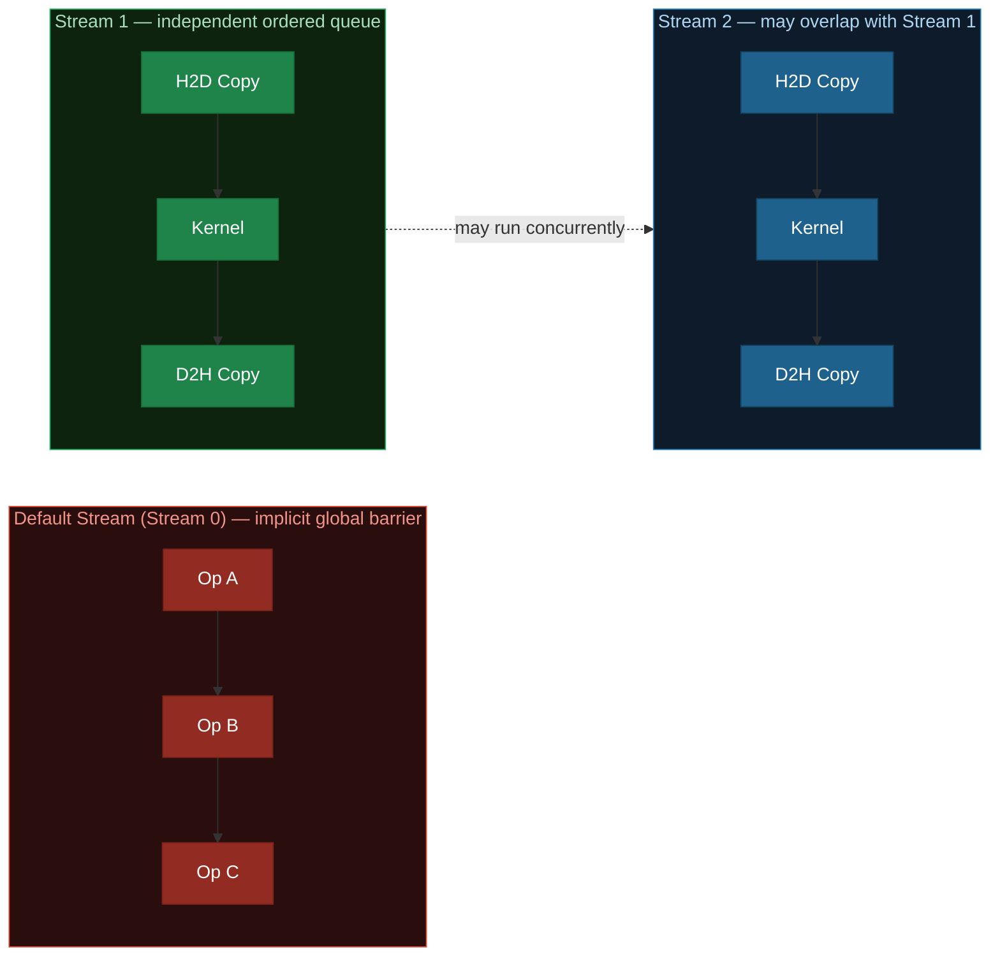
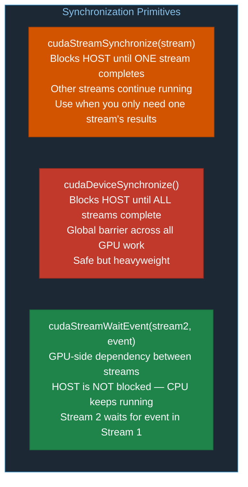
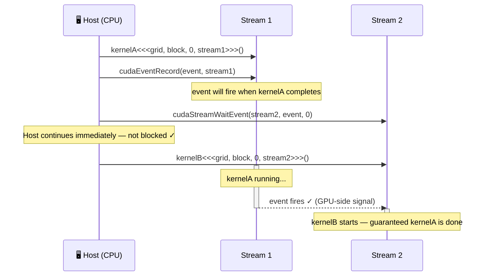
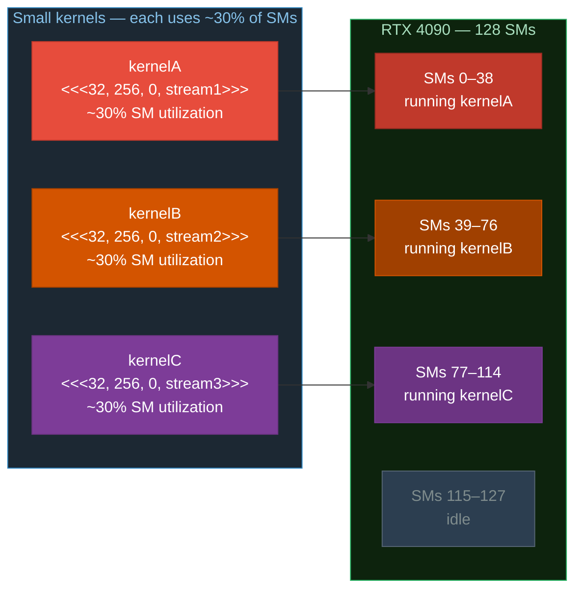

# Chapter 06: CUDA Streams and Concurrency

## 6.1 What is a CUDA Stream?

A **CUDA stream** is an ordered queue of GPU operations (kernel launches, memory copies, events). Operations within a single stream execute in order. Operations in **different streams** may execute concurrently.



The **default stream** (stream 0) is special: it synchronizes with all other streams by default — avoid mixing it with non-default streams.

## 6.2 Why Use Streams?

Modern GPUs have **three independent hardware engines** that can run simultaneously:


Without streams you serialize all three engines. With streams you fill all three simultaneously.

### Sequential vs. Pipelined Execution

**Sequential — no streams** (one engine active at a time, total: 14 units):

```mermaid
gantt
    title Sequential — No Streams  (engines idle most of the time)
    dateFormat X
    axisFormat %ss

    section H2D Engine
    Copy A to GPU   : 0, 2
    Copy B to GPU   : 7, 9

    section Compute Engine
    Kernel A        : 2, 5
    Kernel B        : 9, 12

    section D2H Engine
    Copy A from GPU : 5, 7
    Copy B from GPU : 12, 14
```



**Pipelined — 2 streams** (all three engines overlap, total: 10 units, ~29% faster):

```mermaid
gantt
    title Pipelined — 2 Streams  (all three engines busy simultaneously)
    dateFormat X
    axisFormat %ss

    section H2D Engine
    [S0] Copy A to GPU   : 0, 2
    [S1] Copy B to GPU   : 2, 4

    section Compute Engine
    [S0] Kernel A        : 2, 5
    [S1] Kernel B        : 5, 8

    section D2H Engine
    [S0] Copy A from GPU : 7, 9
    [S1] Copy B from GPU : 8, 10
```



> While Kernel A runs on the Compute Engine, Copy B is simultaneously loading on the H2D Engine — **hiding transfer latency behind computation**.

## 6.3 Creating and Using Streams

```c
// Create streams
cudaStream_t stream1, stream2;
cudaStreamCreate(&stream1);
cudaStreamCreate(&stream2);

// Launch async operations on a stream
cudaMemcpyAsync(d_dst, h_src, bytes, cudaMemcpyHostToDevice, stream1);
myKernel<<<grid, block, 0, stream1>>>(d_data);          // 4th param is stream
cudaMemcpyAsync(h_dst, d_src, bytes, cudaMemcpyDeviceToHost, stream1);

// Synchronize a single stream
cudaStreamSynchronize(stream1);  // Wait only for stream1 to finish

// Or synchronize all streams
cudaDeviceSynchronize();

// Destroy when done
cudaStreamDestroy(stream1);
cudaStreamDestroy(stream2);
```

### Pinned Memory is Required for True Async Transfers

```diff
  Regular malloc (pageable) — cudaMemcpyAsync silently falls back to synchronous:

- float *h_data = (float*)malloc(bytes);                    // pageable memory
- cudaMemcpyAsync(d_data, h_data, bytes, H2D, stream);      // BLOCKS the host! ✗
- (OS may page-out memory during transfer — CUDA must pin it first, then copy)
- (No overlap with kernel execution — defeats the purpose of streams) ✗

  cudaMallocHost (pinned / page-locked) — true non-blocking async transfer:

+ float *h_data;
+ cudaMallocHost(&h_data, bytes);                            // pinned host memory
+ cudaMemcpyAsync(d_data, h_data, bytes, H2D, stream);      // truly non-blocking ✓
+ (Memory locked in RAM — GPU DMA engine transfers without CPU involvement)
+ (CPU returns immediately — overlap with kernel execution is possible) ✓

+ // Always free with the matching call:
+ cudaFreeHost(h_data);
```

## 6.4 Stream Synchronization Primitives



### CUDA Events Across Streams

Events create dependency relationships between streams **without blocking the host**:



### Non-Blocking Streams

By default, all streams synchronize with the default stream. Create a truly independent stream:
```c
cudaStreamCreateWithFlags(&stream, cudaStreamNonBlocking);
```

## 6.5 The Double-Buffering Pipeline Pattern

For processing large datasets in chunks, alternate two streams to achieve maximum overlap:

```mermaid
gantt
    title Double-Buffer Pipeline — 4 chunks, 2 streams alternating
    dateFormat X
    axisFormat %ss

    section H2D Engine
    [S0] Chunk 0  : 0,  2
    [S1] Chunk 1  : 2,  4
    [S0] Chunk 2  : 4,  6
    [S1] Chunk 3  : 6,  8

    section Compute Engine
    [S0] Chunk 0  : 2,  5
    [S1] Chunk 1  : 5,  8
    [S0] Chunk 2  : 8,  11
    [S1] Chunk 3  : 11, 14

    section D2H Engine
    [S0] Chunk 0  : 5,  7
    [S1] Chunk 1  : 8,  10
    [S0] Chunk 2  : 11, 13
    [S1] Chunk 3  : 14, 16
```



Each chunk alternates between Stream 0 and Stream 1. While chunk N is being **computed** on Stream 0, chunk N+1's data is being **loaded** on Stream 1 — **transfer latency fully hidden behind computation** after the first chunk.


## 6.6 Concurrent Kernel Execution

On GPUs with `concurrentKernels = 1` (almost all modern GPUs), multiple small kernels in different streams can run simultaneously if the GPU has idle SMs:



This is useful when a single kernel doesn't saturate all SMs.

## 6.7 Exercises

1. Run `01_streams_basic.cu`. Measure the speedup from using multiple streams. Does it match your expectation based on the H2D/compute/D2H breakdown?
2. In `02_async_overlap.cu`, vary the chunk size (try 1/2, 1/4, 1/8 of total data). How does chunk size affect the overlap efficiency?
3. What happens if you forget `cudaMallocHost` and use regular `malloc` for async transfers? Add a test to verify.
4. Add a third stream to the double-buffering example. Does performance improve? Why or why not?
5. Use `cudaStreamCreateWithFlags(&s, cudaStreamNonBlocking)` and observe how it differs from default-flag streams when mixing with stream 0.

## 6.8 Key Takeaways

- Streams are ordered queues; different streams can overlap on independent GPU engines.
- `cudaMemcpyAsync` **requires pinned host memory** (`cudaMallocHost`) — pageable memory silently serializes.
- The kernel launch **4th** parameter is the stream (3rd is dynamic shared memory size).
- Use `cudaStreamWaitEvent` for GPU-side stream dependencies without blocking the CPU.
- The **double-buffer pipeline** alternates two streams to keep all three GPU engines busy.
- Don't mix default stream (stream 0) with non-default streams — it acts as a global barrier.
