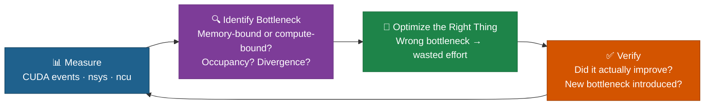
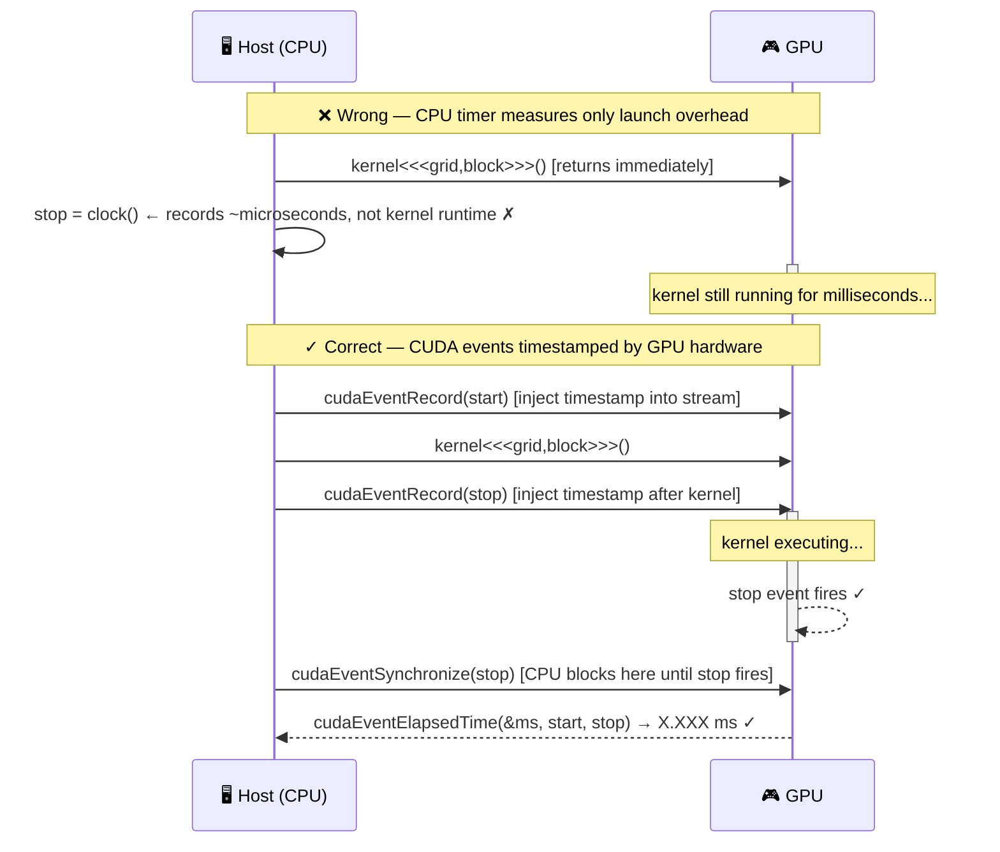
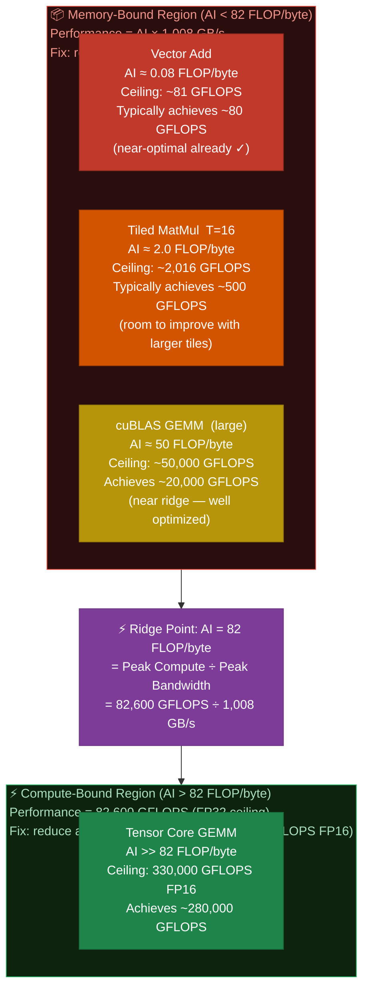
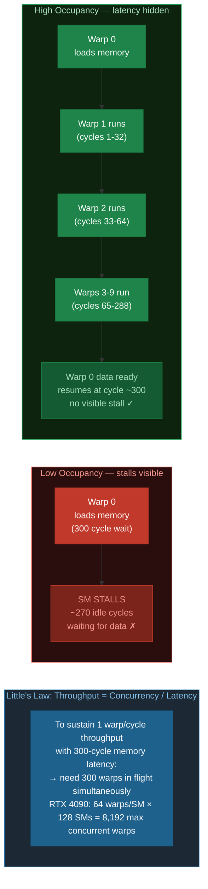
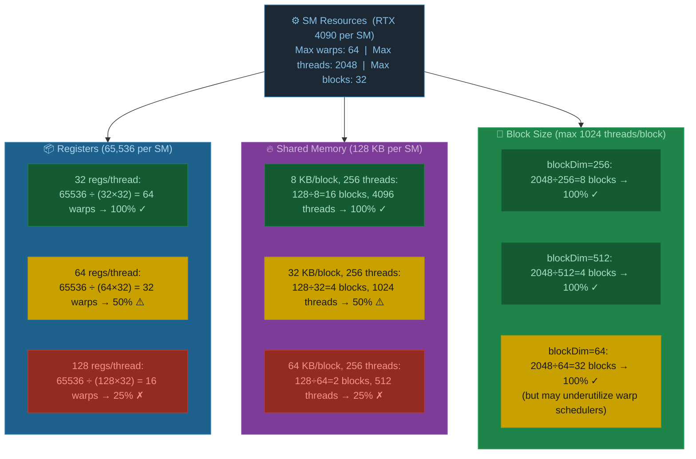
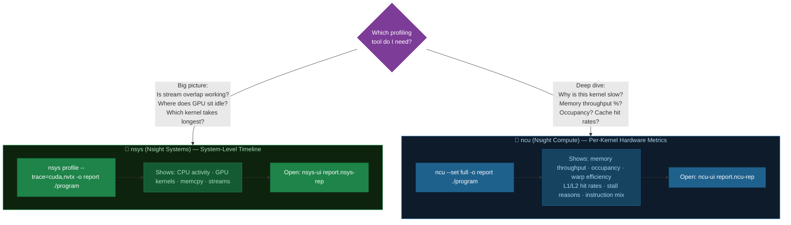
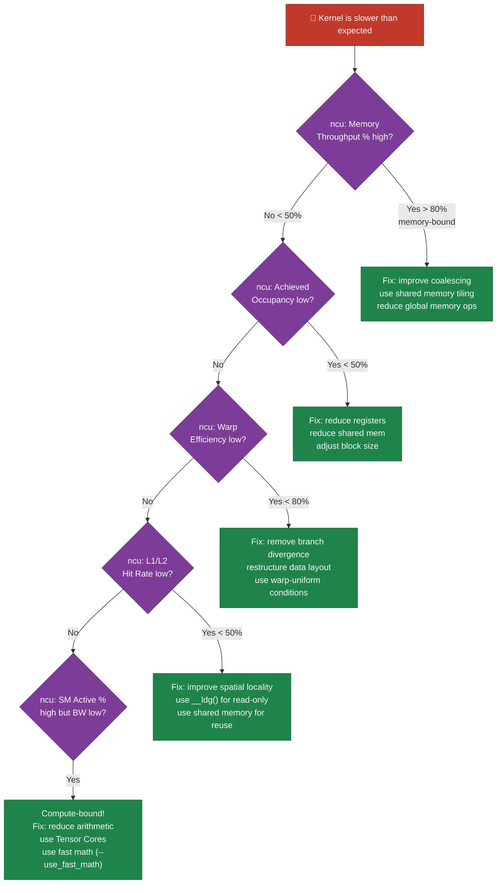

# Chapter 07: Profiling and Performance Analysis

## 7.1 The Performance Mindset

Before optimizing anything, **measure first**. Guessing where the bottleneck is will lead you astray. CUDA provides precise tools for understanding what's happening on the GPU.



The two key questions before optimizing:
1. **Is this kernel memory-bound or compute-bound?** (The roofline model answers this)
2. **Is the GPU being fully utilized?** (Occupancy and warp efficiency answer this)

## 7.2 CUDA Events for Precise Timing

CPU timing with `clock()` or `gettimeofday()` is inaccurate for GPU code because kernel launches are asynchronous. Use **CUDA events** — they are timestamped by the GPU itself.



```c
cudaEvent_t start, stop;
cudaEventCreate(&start);
cudaEventCreate(&stop);

cudaEventRecord(start);           // Inject timestamp into default stream
myKernel<<<grid, block>>>(...);   // Kernel runs asynchronously
cudaEventRecord(stop);

cudaEventSynchronize(stop);       // Block CPU until stop event fires

float ms;
cudaEventElapsedTime(&ms, start, stop);  // Time between events in milliseconds
printf("Kernel time: %.3f ms\n", ms);

cudaEventDestroy(start);
cudaEventDestroy(stop);
```

Key rules:
- `cudaEventRecord(e, stream)` places a timestamp in the stream's command queue
- Always call `cudaEventSynchronize(stop)` before reading elapsed time

## 7.3 The Roofline Model

The **roofline model** determines the theoretical peak performance of a kernel based on its **arithmetic intensity** (AI):

```
AI = Total FLOPs executed / Total bytes transferred to/from global memory
```

### The Roofline Shape

```
GFLOPS/s
  │
  │  82,600 ══════════════════════════════════════════ Compute ceiling (FP32)
  │         ╗
  │         ║  ← Compute-bound region (AI > 82 FLOP/byte)
  │         ║     Adding more compute helps; memory is not the limit
  │         ╝
  │   ╔═════╝
  │   ║   ← Memory-bound region (AI < 82 FLOP/byte)
  │   ║      Adding more compute does NOT help — you need less data movement
  │   ║
  └───╨─────────────────────────────────── FLOP/byte
   0.08  2   10   50  82(ridge)  200
```

### RTX 4090 Roofline — Where Do Kernels Land?



## 7.4 SM Occupancy

**Occupancy** = (active warps per SM) / (maximum warps per SM)

Higher occupancy helps the GPU **hide memory latency** by switching between warps while one warp waits for a memory transaction.

### Little's Law Applied to GPUs



### The Three Occupancy Limiters



```c
// Query occupancy for a given kernel and block size
int activeBlocks;
cudaOccupancyMaxActiveBlocksPerMultiprocessor(
    &activeBlocks, myKernel, blockSize, sharedMemBytes);

cudaDeviceProp prop;
cudaGetDeviceProperties(&prop, 0);
float occupancy = (float)(activeBlocks * blockSize)
                / prop.maxThreadsPerMultiProcessor;
printf("Occupancy: %.0f%%\n", occupancy * 100);
```

## 7.5 Nsight Systems and Nsight Compute



### Key Nsight Compute Metrics

| Metric | What it tells you | Good value |
|--------|------------------|------------|
| `Memory Throughput %` | How close to peak bandwidth | > 70% |
| `SM Active Cycles %` | SM utilization | > 80% |
| `Warp Efficiency %` | Non-divergent warp fraction | > 90% |
| `L1 Hit Rate %` | L1 cache effectiveness | > 80% |
| `L2 Hit Rate %` | L2 cache effectiveness | > 60% |
| `Achieved Occupancy` | Actual warp occupancy at runtime | > 50% |

## 7.6 Quick Profiling Commands

```bash
# Time all kernels, no GUI needed
ncu --csv --print-summary per-kernel ./my_program

# Check memory throughput for specific kernel
ncu --metrics l1tex__t_bytes_pipe_lsu_mem_global_op_ld.sum,\
dram__bytes_read.sum,dram__bytes_write.sum ./my_program

# System-level view
nsys profile -d 5 ./my_program

# Profile with NVTX code annotations
# Add to code: nvtxRangePush("MySection"); ... nvtxRangePop();
nsys profile --trace=cuda,nvtx ./my_program
```

### Reading the Results: Diagnosis Flowchart



## 7.7 Exercises

1. Run `01_cuda_events.cu`. Implement a function that measures the time of 3 different kernel configurations and reports bandwidth for each.
2. In `02_occupancy.cu`, add the `__launch_bounds__(256, 4)` qualifier to a kernel and observe how it changes register usage and occupancy.
3. Calculate the arithmetic intensity of tiled matrix multiply from Chapter 04. Based on the roofline model, is it memory-bound or compute-bound?
4. Run Nsight Compute on `01_vector_add` from Chapter 02: `ncu ./vec_add`. What is the achieved memory bandwidth %?
5. Add NVTX annotations to the Chapter 06 async pipeline. Run nsys to verify the overlap is visible in the timeline.

## 7.8 Key Takeaways

- Always use **CUDA events** (not CPU timers) to time GPU kernels — kernels are asynchronous.
- The **roofline model** tells you if you're memory-bound or compute-bound — optimize the right bottleneck.
- **Occupancy** helps hide memory latency via warp switching (Little's Law). 50%+ is usually sufficient.
- Three limiters of occupancy: **registers**, **shared memory**, **block size**.
- **Nsight Systems** for pipeline-level view (stream overlap, CPU/GPU timeline).
- **Nsight Compute** for kernel-level metrics (memory throughput, occupancy, stall reasons).
- `cudaOccupancyMaxPotentialBlockSize` automates finding the optimal block size.
