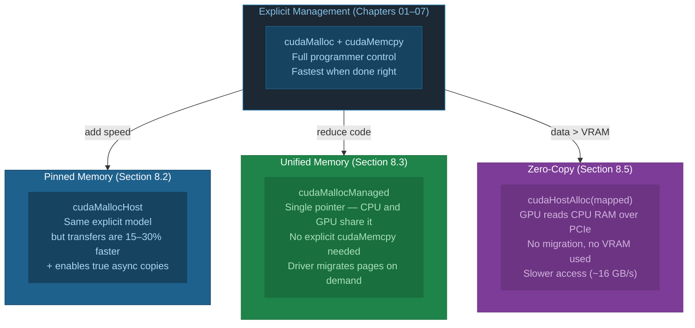
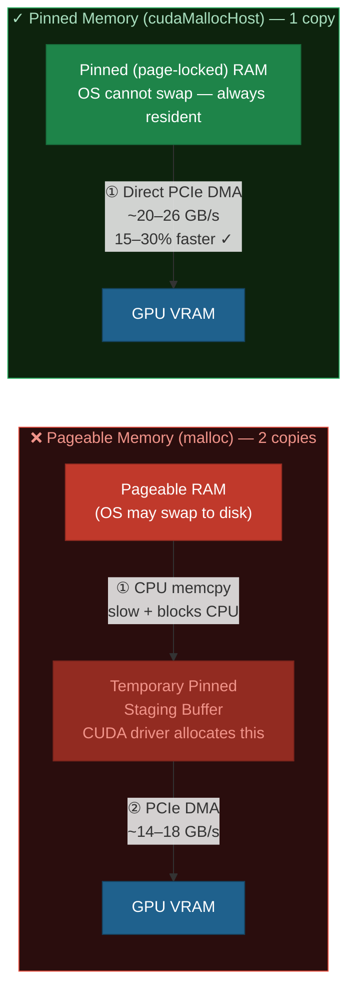
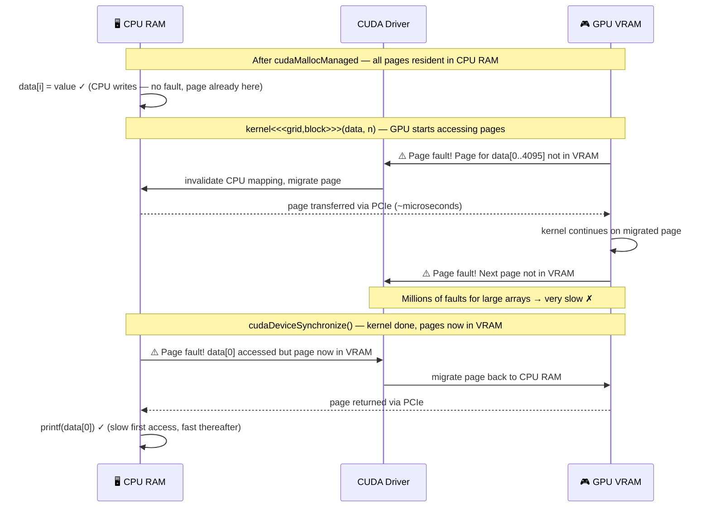
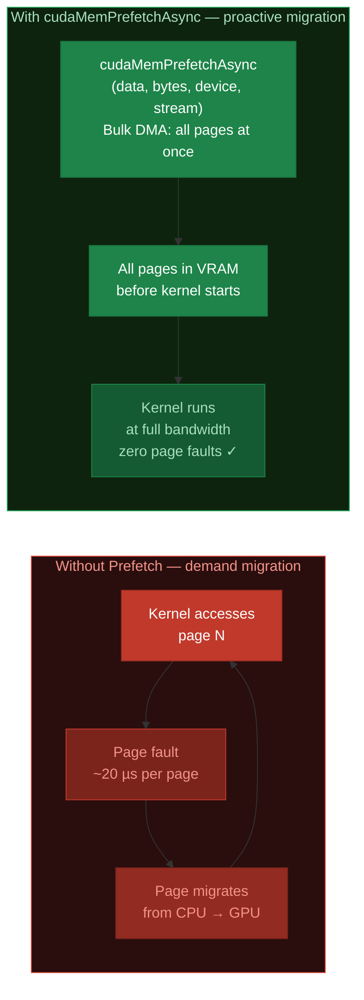
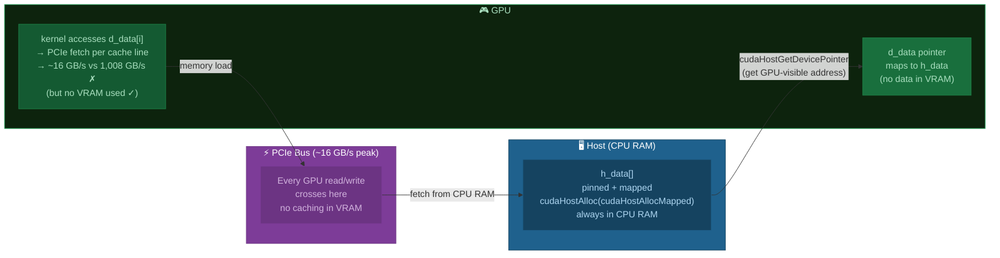
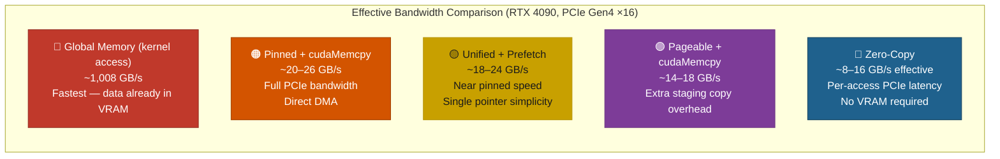
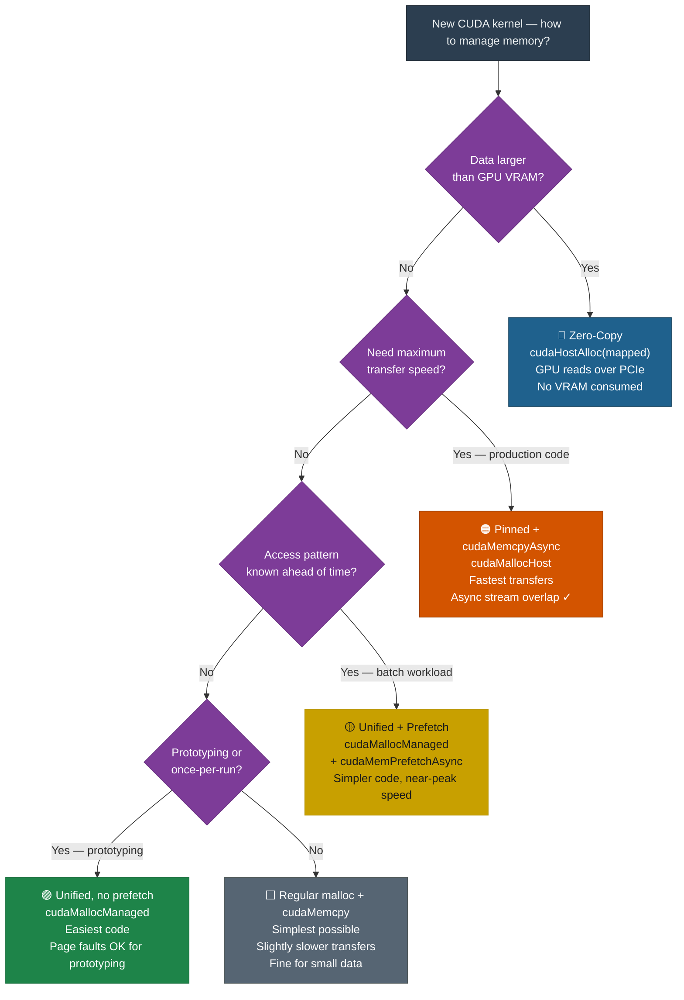

# Chapter 08: Unified Memory and Pinned Memory

## 8.1 The Memory Transfer Problem

Every CUDA program we've written so far has this boilerplate:
```c
cudaMalloc → cudaMemcpy (H2D) → kernel → cudaMemcpy (D2H) → cudaFree
```

This explicit management is efficient but tedious. CUDA offers two alternatives:



## 8.2 Pageable vs Pinned Host Memory

### Transfer Path Comparison



```diff
  Pageable (malloc) path:

- Step 1: CUDA driver allocates a temporary pinned staging buffer  (hidden cost)
- Step 2: CPU copies pageable RAM → staging buffer               (wastes bandwidth)
- Step 3: DMA engine transfers staging buffer → GPU VRAM
- Total:  ~14–18 GB/s effective H2D bandwidth  ✗

  Pinned (cudaMallocHost) path:

+ Step 1: DMA engine transfers pinned RAM → GPU VRAM directly
+ Total:  ~20–26 GB/s effective H2D bandwidth  ✓  (full PCIe Gen4 ×16)
+ Bonus:  cudaMemcpyAsync is truly non-blocking (Chapter 06 streams) ✓
```

```c
// Allocate pinned memory
float *h_pinned;
cudaMallocHost(&h_pinned, bytes);      // Page-locked

// Use exactly like malloc'd memory
for (int i = 0; i < n; i++) h_pinned[i] = (float)i;

// Transfer is faster
cudaMemcpy(d_data, h_pinned, bytes, cudaMemcpyHostToDevice);

// Required for async transfers (cudaMemcpyAsync)
cudaMemcpyAsync(d_data, h_pinned, bytes, cudaMemcpyHostToDevice, stream);

// Must free with cudaFreeHost (NOT free()!)
cudaFreeHost(h_pinned);
```

**Warning**: Too much pinned memory degrades system performance (less physical RAM available for OS paging). Use it selectively for large, frequently-transferred buffers.

## 8.3 Unified Memory (UM)

Unified Memory provides a **single pointer** that both CPU and GPU can dereference — no explicit `cudaMemcpy` needed.

```c
float *data;
cudaMallocManaged(&data, bytes);

// CPU can write directly
for (int i = 0; i < n; i++) data[i] = (float)i;

// GPU can read/write directly in kernel
myKernel<<<grid, block>>>(data, n);
cudaDeviceSynchronize();

// CPU can read back directly (no cudaMemcpy needed!)
printf("data[0] = %f\n", data[0]);

cudaFree(data);
```

### How Unified Memory Works Under the Hood

UM uses **page migration** — each 4 KB page lives in either CPU RAM or GPU VRAM at any one time, migrating on demand:



### Page Fault Cost

```diff
  Unified Memory WITHOUT prefetch — page faults on every new page:

- GPU kernel starts → page fault (data[0..4095] not in VRAM)
-   → driver migrates 4 KB page: ~10–50 µs overhead
- GPU continues → page fault (data[4096..8191] not in VRAM)
-   → driver migrates 4 KB page: ~10–50 µs overhead
- GPU continues → page fault (data[8192..12287]) ...
-   → repeat for every 4 KB page in the array
-
- For 256 MB array = 65,536 pages × ~20 µs = ~1.3 seconds of fault overhead ✗
- (cudaMemcpy would copy 256 MB in ~10 ms — 130× faster!) ✗

  Unified Memory WITH cudaMemPrefetchAsync — zero faults during kernel:

+ cudaMemPrefetchAsync(data, bytes, device, stream)
+   → Bulk DMA transfer of ALL pages to GPU VRAM
+   → Same path as cudaMemcpy: ~10 ms for 256 MB ✓
+ kernel runs with all data already in VRAM → zero page faults ✓
+ Near-identical performance to explicit cudaMemcpy ✓
```

## 8.4 Prefetching and Memory Advisories

### cudaMemPrefetchAsync



```c
int device = 0;
cudaGetDevice(&device);

// Prefetch entire array to GPU before kernel
cudaMemPrefetchAsync(data, bytes, device, stream);
myKernel<<<grid, block, 0, stream>>>(data, n);

// Prefetch back to CPU before reading
cudaMemPrefetchAsync(data, bytes, cudaCpuDeviceId, stream);
cudaStreamSynchronize(stream);
printf("data[0] = %f\n", data[0]);  // No page fault!
```

### cudaMemAdvise

Hints to the driver about access patterns:

```c
// Data primarily lives on GPU (avoid migration to CPU)
cudaMemAdvise(data, bytes, cudaMemAdviseSetPreferredLocation, device);

// Data is read by GPU but owned by CPU (map rather than migrate)
cudaMemAdvise(data, bytes, cudaMemAdviseSetReadMostly, device);

// CPU also accesses — set up direct mapping
cudaMemAdvise(data, bytes, cudaMemAdviseSetAccessedBy, cudaCpuDeviceId);
```

## 8.5 Zero-Copy Memory

An alternative: map host memory directly into the GPU's address space. No migration — GPU reads over PCIe on every access.



```c
float *h_data, *d_data;
cudaHostAlloc(&h_data, bytes, cudaHostAllocMapped);  // Pinned + mapped
cudaHostGetDevicePointer(&d_data, h_data, 0);        // Get GPU-side pointer

// Kernel accesses d_data → reads over PCIe (~16 GB/s vs 1 TB/s VRAM)
myKernel<<<grid, block>>>(d_data, n);
```

Zero-copy is useful when:
- Data is accessed only once (no reuse benefit from migration)
- Data is too large to fit in GPU VRAM
- CPU and GPU access the same data roughly equally

## 8.6 Bandwidth at a Glance



## 8.7 When to Use Each



| Approach | Use When |
|----------|---------|
| Regular malloc + cudaMemcpy | Maximum performance, large repeated transfers |
| Pinned (cudaMallocHost) | Same as above but need faster transfers or async copies |
| Unified Memory + prefetch | Simpler code, data access pattern known ahead of time |
| Unified Memory (no prefetch) | Prototyping, irregular access patterns |
| Zero-copy | Data > VRAM, accessed once, or strong CPU-GPU sharing |

## 8.8 Exercises

1. In `01_pinned_memory.cu`, add a 4 GB transfer test. At what size does the bandwidth difference between pageable and pinned stabilize?
2. In `02_unified_memory.cu`, comment out the prefetch calls. Run and observe the slowdown from page faults. How much slower is it?
3. Try running a kernel on unified memory **without** `cudaDeviceSynchronize` before CPU access. What happens? Why?
4. Implement a benchmark using `cudaMemAdvise(data, bytes, cudaMemAdviseSetReadMostly, device)` for a read-only data array. Does it improve performance?

## 8.9 Key Takeaways

- **Pinned memory** eliminates the staging copy for H2D/D2H transfers, giving 15–30% faster transfers.
- **Pinned memory is required** for `cudaMemcpyAsync` to be truly asynchronous.
- **Unified memory** uses a single pointer for CPU+GPU but incurs page fault costs on first access.
- Use **cudaMemPrefetchAsync** to eliminate page faults by migrating data proactively — matches cudaMemcpy speed.
- **Zero-copy** maps CPU memory into GPU space — useful for large data or infrequent access, but bandwidth is PCIe-limited (~16 GB/s vs 1 TB/s VRAM).
- Don't over-use pinned memory — it reduces available physical RAM for the OS.
