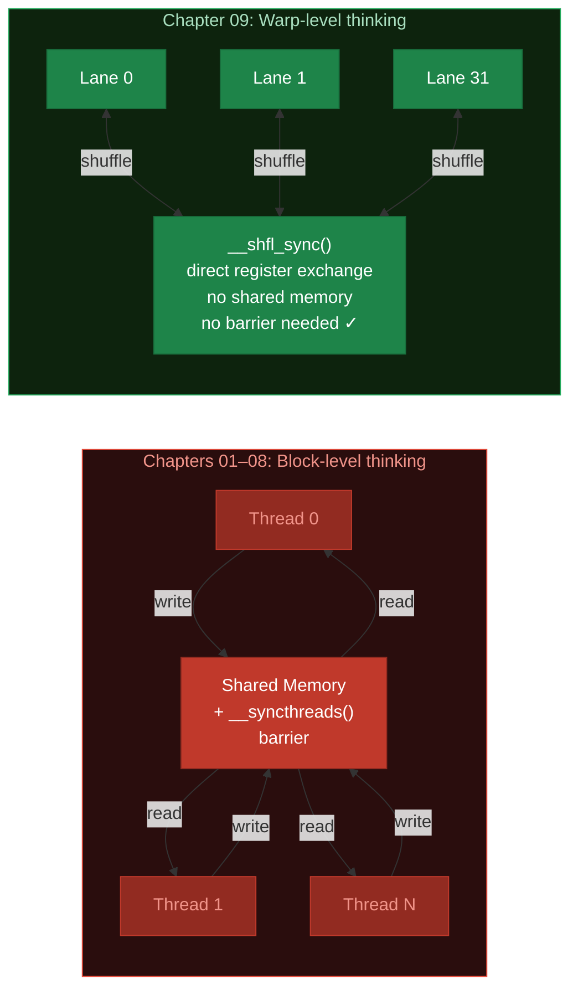
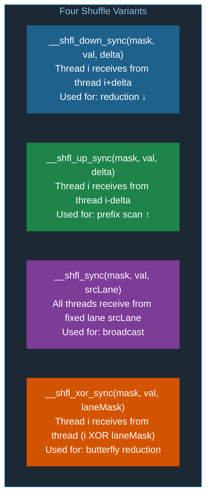
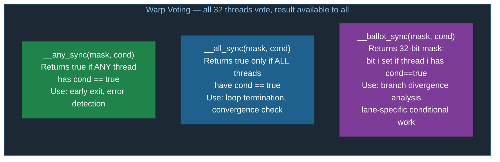
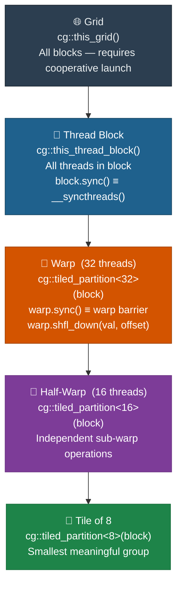
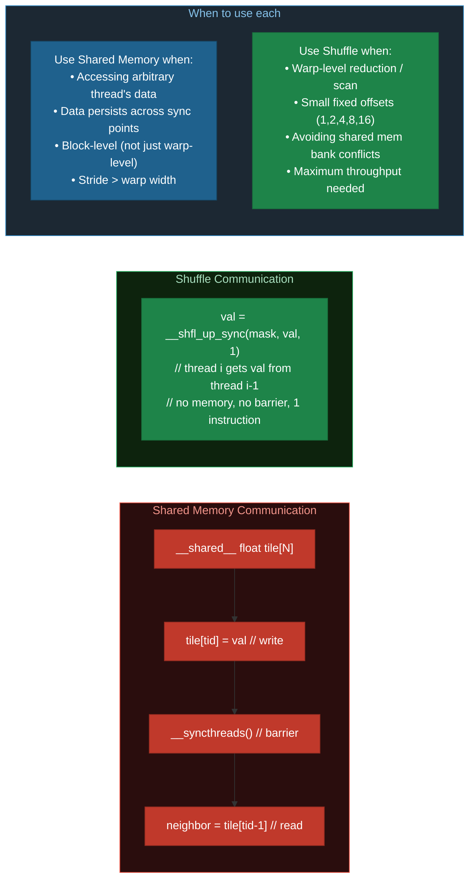

# Chapter 09: Warp-Level Primitives

## 9.1 The Warp as a Programming Unit

So far we've treated threads as independent workers that communicate only through shared memory. But the GPU hardware executes threads in **warps of 32** that are intrinsically synchronized. We can exploit this for faster communication without shared memory or `__syncthreads()`.



## 9.2 Warp Divergence

All 32 threads in a warp execute the same instruction. When different threads need different branches, the warp serializes both paths — threads not on the current path are **masked off** (idle):

```diff
  Divergent kernel:  if (i % 2 == 0) { data[i] *= 2; } else { data[i] += 1; }

  Pass 1 — even threads run branch A, odd threads MASKED:
+ Thread  0: data[ 0] *= 2   ACTIVE  (i%2==0)
- Thread  1: IDLE             MASKED  (i%2==1, waiting)
+ Thread  2: data[ 2] *= 2   ACTIVE
- Thread  3: IDLE             MASKED
+ Thread  4: data[ 4] *= 2   ACTIVE
- Thread  5: IDLE             MASKED
  ...
+ Thread 30: data[30] *= 2   ACTIVE
- Thread 31: IDLE             MASKED
  → 16 of 32 lanes doing useful work  (50% efficiency)

  Pass 2 — odd threads run branch B, even threads MASKED:
- Thread  0: IDLE             MASKED  (waiting)
+ Thread  1: data[ 1] += 1   ACTIVE  (i%2==1)
- Thread  2: IDLE             MASKED
+ Thread  3: data[ 3] += 1   ACTIVE
  ...
- Thread 30: IDLE             MASKED
+ Thread 31: data[31] += 1   ACTIVE
  → 16 of 32 lanes doing useful work  (50% efficiency)

  Total: 2 serialized passes × 50% = 50% warp throughput ✗
  Fix: ensure threads in the same warp take the same branch
```

**Key rule**: Divergence only costs performance when threads in the **same warp** diverge. Threads in *different warps* taking different paths is completely free.

### Measuring Divergence: `__ballot_sync`

```c
// Returns a 32-bit mask where bit i is set if thread i's condition is true
unsigned mask   = 0xffffffff;
unsigned ballot = __ballot_sync(mask, condition);
int active_count = __popc(ballot);  // Count active threads
```

```
__ballot_sync(0xffffffff, i % 2 == 0)  for a warp of 32 threads:

Thread:   31  30  29  28  ...  5   4   3   2   1   0
Even?:     0   1   0   1  ...  0   1   0   1   0   1

Result (hex): 0x55555555
Result (bin): 0101 0101 0101 0101 0101 0101 0101 0101
__popc(0x55555555) = 16  → 16 threads satisfy the condition
```

## 9.3 Warp Shuffle Instructions

Shuffle instructions let threads in a warp **exchange registers directly** — no shared memory, no `__syncthreads()`:



### Data Flow for Each Variant (8-lane example)

```
Lanes:    0    1    2    3    4    5    6    7
Values:  [A]  [B]  [C]  [D]  [E]  [F]  [G]  [H]

__shfl_down_sync(mask, val, 2)  — each lane receives from lane+2:
          ↑────────────────┐
Result:  [C]  [D]  [E]  [F]  [G]  [H]  [G]  [H]
          0    1    2    3    4    5    6*   7*   (*lanes 6,7 undefined)

__shfl_up_sync(mask, val, 2)  — each lane receives from lane-2:
               ┌────────────────↓
Result:  [A]  [B]  [A]  [B]  [C]  [D]  [E]  [F]
          0*   1*   2    3    4    5    6    7    (*lanes 0,1 unchanged)

__shfl_sync(mask, val, 0)  — all lanes receive from lane 0 (broadcast):
Result:  [A]  [A]  [A]  [A]  [A]  [A]  [A]  [A]
              ↑────↑────↑────↑────↑────↑────↑  (broadcast from lane 0)

__shfl_xor_sync(mask, val, 1)  — butterfly XOR 1 (i ↔ i XOR 1):
          0↔1       2↔3       4↔5       6↔7
Result:  [B]  [A]  [D]  [C]  [F]  [E]  [H]  [G]
```

### Warp Reduction Without Shared Memory

```c
__device__ float warpSum(float val)
{
    unsigned mask = 0xffffffff;
    val += __shfl_down_sync(mask, val, 16);  // Sum with thread i+16
    val += __shfl_down_sync(mask, val,  8);  // Sum with thread i+8
    val += __shfl_down_sync(mask, val,  4);
    val += __shfl_down_sync(mask, val,  2);
    val += __shfl_down_sync(mask, val,  1);
    return val;  // Thread 0 has the warp sum
}
```

```diff
  warpSum — 8-lane illustration  (full warp is 32 lanes)
  Start:     [3]  [1]  [4]  [1]  [5]  [9]  [2]  [6]

  offset=4 → lane i += lane i+4:
+ Lane 0: 3+5=8    Lane 1: 1+9=10   Lane 2: 4+2=6    Lane 3: 1+6=7
  Lane 4: 5        Lane 5: 9        Lane 6: 2         Lane 7: 6

  offset=2 → lane i += lane i+2:
+ Lane 0: 8+6=14   Lane 1: 10+7=17
  Lane 2: 6        Lane 3: 7

  offset=1 → lane i += lane i+1:
+ Lane 0: 14+17=31  ← final warp sum in lane 0 ✓

  No shared memory allocated ✓
  No __syncthreads() needed ✓   (warp executes in lockstep — SIMT)
  5 shuffle instructions total  ✓
```

### Warp Broadcast

```c
// Broadcast lane 0's value to all threads in the warp
float shared_val = __shfl_sync(0xffffffff, my_val, 0);
```

## 9.4 Warp Voting



```c
unsigned mask = 0xffffffff;

// true if ANY thread has condition=true
bool any = __any_sync(mask, condition);

// true if ALL threads have condition=true
bool all = __all_sync(mask, condition);

// 32-bit mask of which threads have condition=true
unsigned ballot = __ballot_sync(mask, condition);
```

Useful for early exit, conditional work, and debugging.

## 9.5 Cooperative Groups

Cooperative Groups (CUDA 9+) provide a **safe, flexible API** for synchronizing groups of threads at different granularities without hardcoding warp assumptions:



```c
#include <cooperative_groups.h>
namespace cg = cooperative_groups;

__global__ void myKernel(float *data)
{
    cg::thread_block block = cg::this_thread_block();
    cg::thread_block_tile<32> warp  = cg::tiled_partition<32>(block);
    cg::thread_block_tile<16> hwarp = cg::tiled_partition<16>(block);

    block.sync();   // equivalent to __syncthreads()
    warp.sync();    // faster — syncs only 32 threads

    // Shuffle via cooperative groups (same as __shfl_down_sync)
    float val = data[block.thread_rank()];
    val += warp.shfl_down(val, 16);

    // Built-in warp reduce (CUDA 11+) — cleanest API
    float sum = cg::reduce(warp, val, cg::plus<float>());
}
```

### Shared Memory vs Shuffle: Trade-offs



## 9.6 Exercises

1. In `01_warp_divergence.cu`, restructure the divergent kernel to use `__ballot_sync` to determine which threads need extra work, then apply it only to those threads. Does it help?
2. Implement a warp-level prefix scan (inclusive sum) using `__shfl_up_sync`.
3. In `03_cooperative_groups.cu`, use `cg::tiled_partition<8>` to create sub-warp groups of 8 threads. Implement a reduction within each group.
4. Implement a warp-based bitonic sort for 32 elements using `__shfl_xor_sync`.

## 9.7 Key Takeaways

- Warp divergence only hurts performance when threads in the **same warp** diverge — different warps diverging is free.
- `__shfl_down_sync` enables warp-level reduction with **no shared memory and no `__syncthreads()`**.
- Always pass an explicit active thread mask (`0xffffffff` for full warps) to all shuffle/vote functions.
- `__ballot_sync` returns a 32-bit bitmask — use `__popc()` to count active threads.
- Cooperative groups provide a cleaner, more portable API for warp-level programming.
- `cg::reduce(warp, val, cg::plus<float>())` is the simplest warp reduction in modern CUDA.
