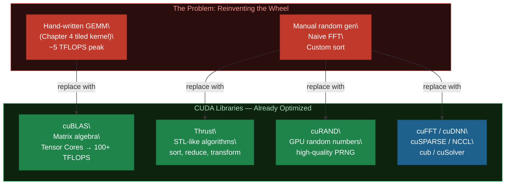
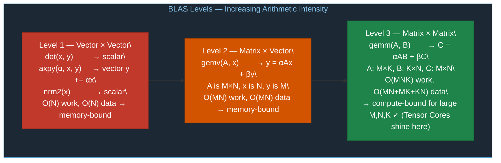
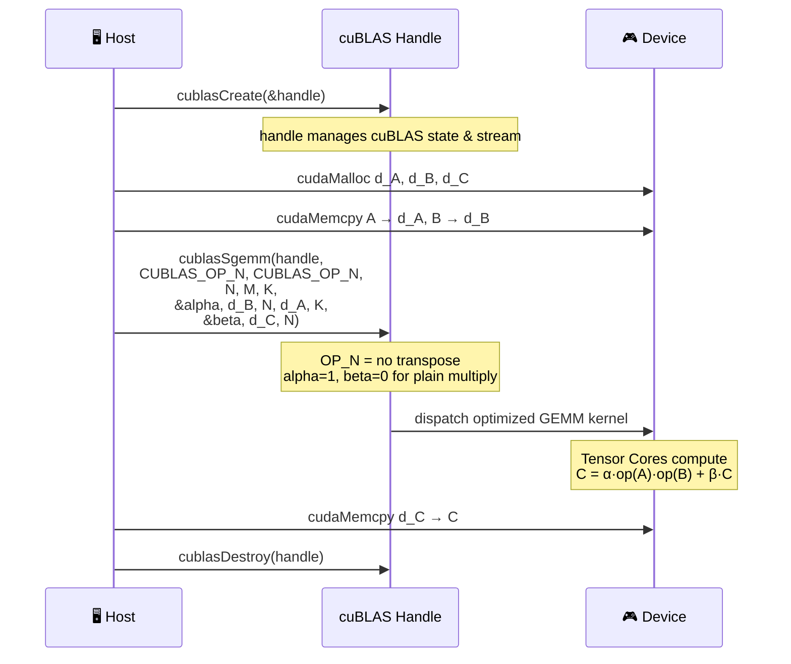
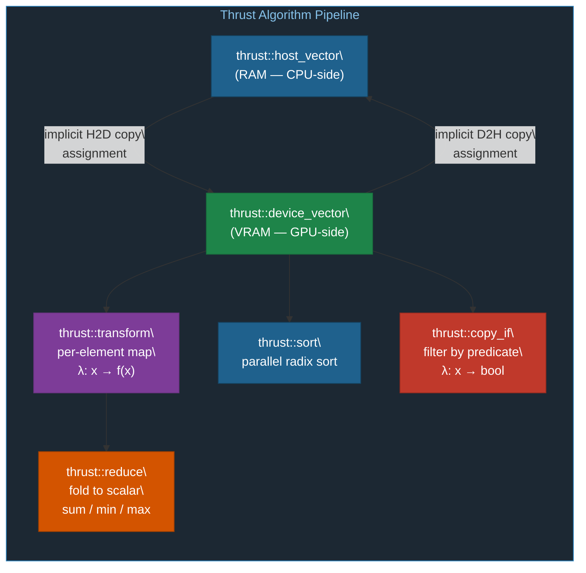
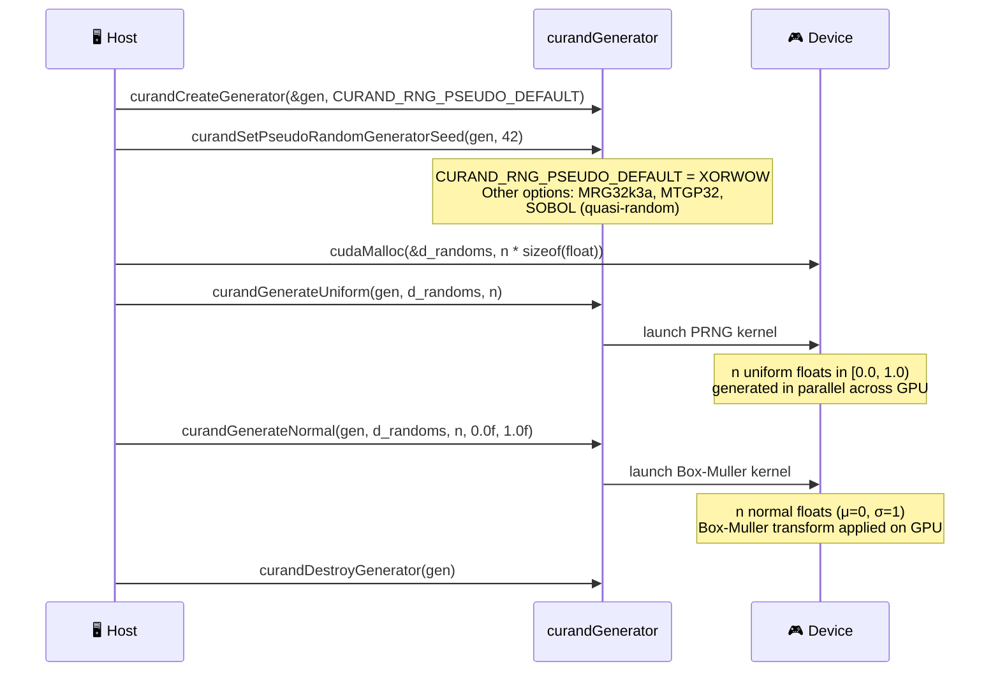
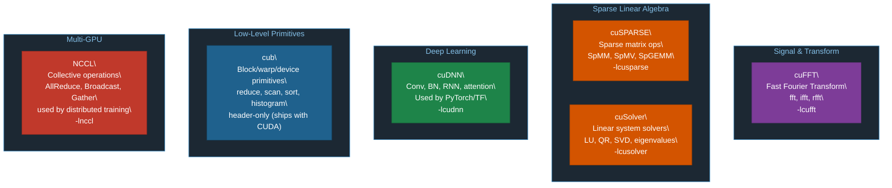
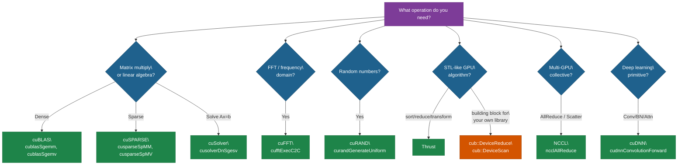

# Chapter 10: CUDA Libraries — cuBLAS, Thrust, and cuRAND

## 10.1 Why Use Libraries?

NVIDIA provides battle-hardened libraries that exploit every GPU optimization: hardware-specific kernel dispatch, Tensor Core usage, auto-tuned parameters, and continuous updates as new hardware ships.



**Rule**: Use libraries first, write custom kernels only for unique workloads that no library covers.

## 10.2 cuBLAS

cuBLAS is NVIDIA's GPU implementation of the BLAS (Basic Linear Algebra Subprograms) standard.

### BLAS Level Hierarchy



### Column-Major Convention (Critical!)

cuBLAS uses **column-major** storage (like Fortran), but C/C++ uses **row-major**. This is the #1 source of confusion.

```
Row-major (C/C++):          Column-major (cuBLAS/Fortran):
Matrix A =                  Matrix A =
  [1  2  3]                   [1  2  3]
  [4  5  6]                   [4  5  6]

  Memory layout (row-major):   Memory layout (col-major):
  [1, 2, 3, 4, 5, 6]          [1, 4, 2, 5, 3, 6]
   row 0──────  row 1──────    col 0──  col 1──  col 2──

  element [r][c] at index:     element [r][c] at index:
    c + r * num_cols              r + c * num_rows
```

```diff
  Naive approach — will produce WRONG results:

- // Row-major C array passed directly to cuBLAS
- cublasSgemm(handle, CUBLAS_OP_N, CUBLAS_OP_N, M, N, K,
-             &alpha, A, M, B, K, &beta, C, M);
- // cuBLAS interprets row-major A as column-major Aᵀ → wrong answer ✗

  Correct approach — use the identity (A·B)ᵀ = Bᵀ·Aᵀ:

+ // Row-major A(M×K) = Column-major Aᵀ(K×M)
+ // We want C = A·B, so compute Cᵀ = Bᵀ·Aᵀ
+ // In column-major terms: C_out(N×M) = B_in(N×K) · A_in(K×M)
+ cublasSgemm(handle, CUBLAS_OP_N, CUBLAS_OP_N,
+             N, M, K,              // swap N and M
+             &alpha, B, N, A, K,   // swap A and B, use N as lda
+             &beta, C, N);         // ldc = N
+ // The result stored in C is our correct row-major C ✓
```

### cublasSgemm Call Flow



```c
cublasStatus_t cublasSgemm(
    cublasHandle_t handle,
    cublasOperation_t transa, cublasOperation_t transb,
    int m, int n, int k,
    const float *alpha,    // Scalar for A*B
    const float *A, int lda,   // Leading dimension of A
    const float *B, int ldb,   // Leading dimension of B
    const float *beta,     // Scalar for C (accumulate)
    float *C, int ldc          // Leading dimension of C
);
// Computes: C = alpha * op(A) * op(B) + beta * C
```

### cuBLAS vs Hand-Written Tiled GEMM


## 10.3 Thrust

Thrust is a C++ template library that provides STL-like algorithms for GPU. It is **header-only** — no linking required.



```cpp
#include <thrust/device_vector.h>
#include <thrust/transform.h>
#include <thrust/reduce.h>
#include <thrust/sort.h>

thrust::device_vector<float> d_vec(1000, 1.0f);  // GPU vector of 1000 ones

// Transform: square each element
thrust::transform(d_vec.begin(), d_vec.end(), d_vec.begin(),
                  [] __device__ (float x) { return x * x; });

// Reduce: sum
float sum = thrust::reduce(d_vec.begin(), d_vec.end(), 0.0f);

// Sort
thrust::sort(d_vec.begin(), d_vec.end());

// Filter: keep only positive elements
thrust::device_vector<float> d_pos(d_vec.size());
auto end = thrust::copy_if(d_vec.begin(), d_vec.end(), d_pos.begin(),
                           [] __device__ (float x) { return x > 0.0f; });

// Transfer to/from host
thrust::host_vector<float> h_vec = d_vec;  // Implicit D2H copy
```

```diff
  Thrust vs raw CUDA — trade-offs:

+ Thrust: simple, composable, header-only, works like STL       ✓
+ Thrust: handles memory management automatically               ✓
+ Thrust: good for prototyping and non-critical paths           ✓
- Thrust: less control over shared memory / block size          ✗
- Thrust: harder to fuse multiple passes into one kernel        ✗
- Thrust: custom operations must be device lambdas              ✗

  Use Thrust when correctness and development speed matter more than
  squeezing out the last 10% of performance.
```

## 10.4 cuRAND

cuRAND generates high-quality random numbers directly on the GPU, avoiding the PCIe bottleneck of CPU-generated random data.



```c
#include <curand.h>

curandGenerator_t gen;
curandCreateGenerator(&gen, CURAND_RNG_PSEUDO_DEFAULT);
curandSetPseudoRandomGeneratorSeed(gen, 42);

float *d_randoms;
cudaMalloc(&d_randoms, n * sizeof(float));

// Generate n uniform floats in [0, 1)
curandGenerateUniform(gen, d_randoms, n);

// Generate n normally-distributed floats (mean=0, stddev=1)
curandGenerateNormal(gen, d_randoms, n, 0.0f, 1.0f);

curandDestroyGenerator(gen);
```

Link with `-lcurand`.

## 10.5 Other Libraries



| Library | Purpose | Link Flag |
|---------|---------|-----------|
| cuFFT | Fast Fourier Transform | `-lcufft` |
| cuSPARSE | Sparse matrix operations | `-lcusparse` |
| cuDNN | Deep neural network primitives | `-lcudnn` |
| cuSolver | Dense/sparse linear system solvers | `-lcusolver` |
| NCCL | Multi-GPU collective operations | `-lnccl` |
| cub | Low-level GPU primitives (building blocks) | header-only |

### When to Use Which Library



## 10.6 Exercises

1. In `01_cublas_gemm.cu`, change the matrix size from 2048 to 512 and 4096. How does GFLOPS scale with matrix size? (Hint: cuBLAS has overhead for small matrices.)
2. Implement a batched GEMM using `cublasSgemmBatched` for 100 small 64×64 matrices.
3. In `02_thrust_basics.cu`, use `thrust::transform_reduce` to compute the L2 norm (sqrt of sum of squares) in a single call.
4. Write a Thrust-based filter that extracts only positive elements from a vector using `thrust::copy_if`.
5. Use cuRAND to verify the Central Limit Theorem: generate 1000 samples of 100 uniform random numbers each, compute their means, and verify the mean of means ≈ 0.5 and stddev of means ≈ 0.5/√100.

## 10.7 Key Takeaways

- cuBLAS uses **column-major** storage — use the transpose trick `(A·B)ᵀ = Bᵀ·Aᵀ` for row-major arrays.
- cuBLAS GEMM is **orders of magnitude faster** than our hand-written tiled version (Tensor Cores, auto-tuning, etc.).
- Thrust provides STL-like algorithms; use it for quick GPU algorithm prototyping.
- cuRAND generates high-quality random numbers efficiently on the GPU — avoids PCIe transfer of CPU-generated data.
- `cub` provides the low-level building blocks that Thrust and cuBLAS are built on — use it when you need fine-grained control.
- Use libraries as building blocks; write custom kernels only for unique workloads.
