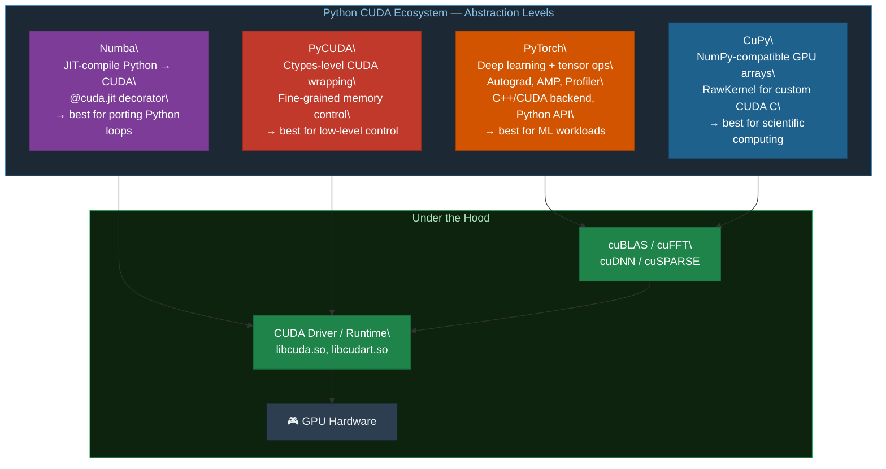
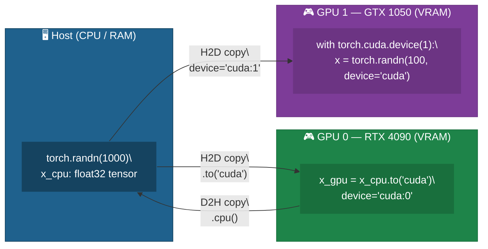
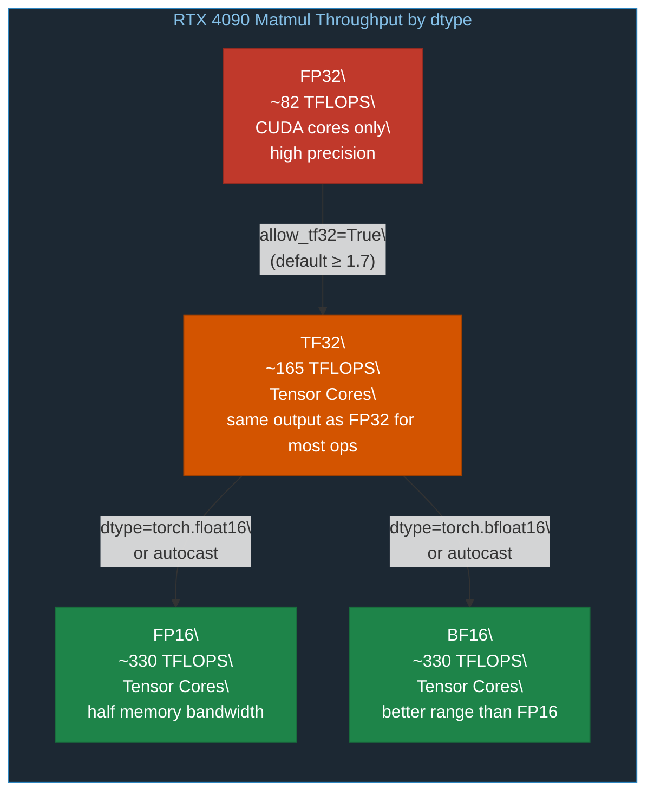
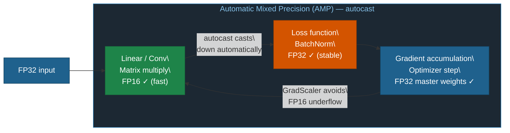
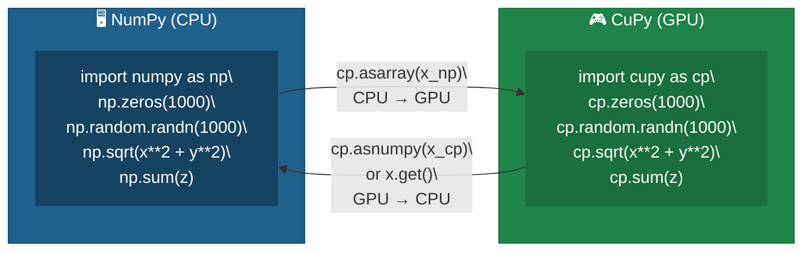
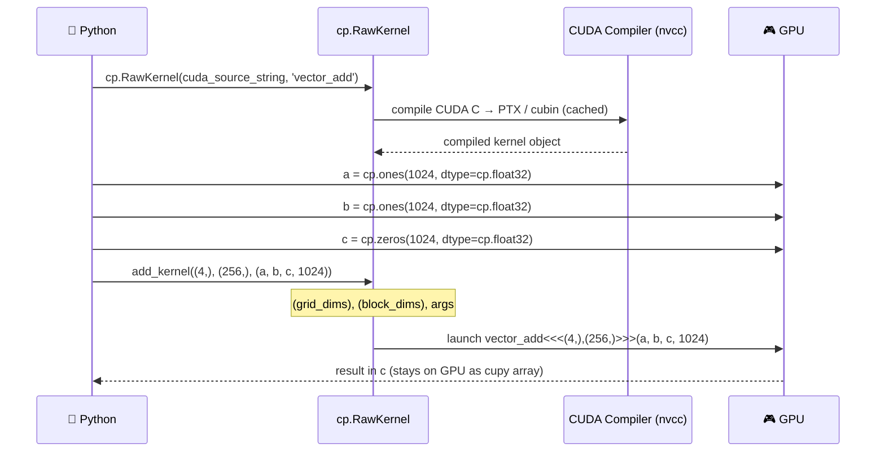
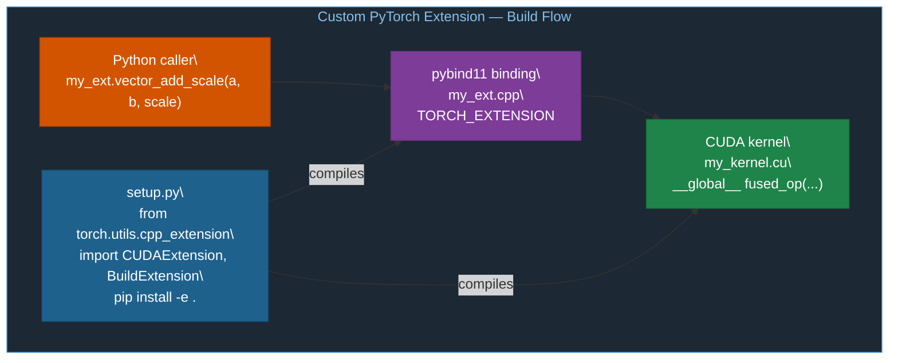
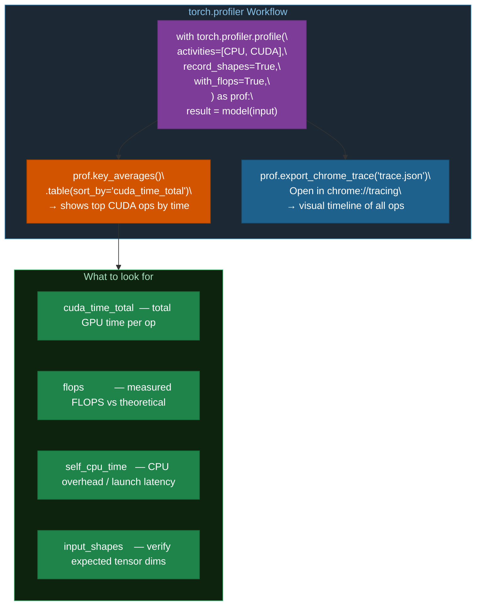
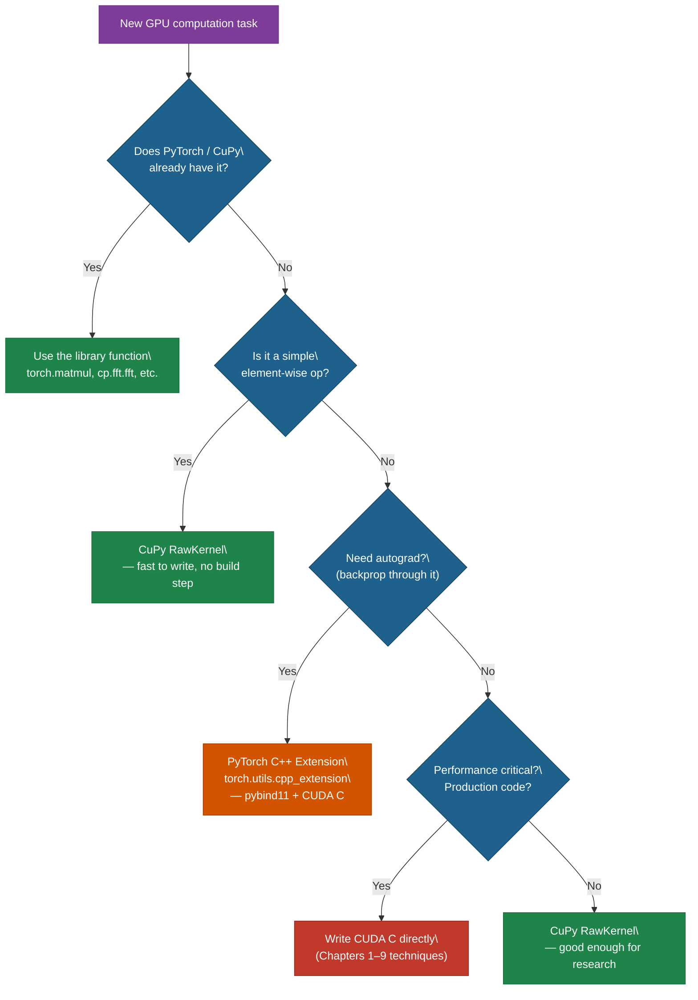

# Chapter 11: CUDA with Python — PyTorch and CuPy

## 11.1 Python CUDA Ecosystem

Python is the dominant language for GPU computing in ML and scientific computing. Several libraries expose GPU power at different abstraction levels:



This chapter focuses on **PyTorch** and **CuPy** — the two most widely used libraries.

## 11.2 Setup

```bash
# Activate the virtual environment
source /home/rob/PythonEnvironments/LearnCUDA/.learncuda/bin/activate

# Install PyTorch with CUDA 12.1 support
pip install torch torchvision --index-url https://download.pytorch.org/whl/cu121

# Install CuPy for CUDA 12.x
pip install cupy-cuda12x

# Install helpers
pip install numpy matplotlib jupyter
```

## 11.3 PyTorch CUDA Basics

### Device Management

```python
import torch

torch.cuda.is_available()        # True if CUDA GPU present
torch.cuda.device_count()        # Number of GPUs
torch.cuda.get_device_name(0)    # "NVIDIA GeForce RTX 4090"

# Create tensor on GPU
x = torch.zeros(1000, device='cuda')
x_cpu = torch.randn(1000)
x_gpu = x_cpu.to('cuda')
x_back = x_gpu.cpu()
```



### Accurate Timing (GPU ops are async!)

```diff
  WRONG: GPU ops are async — CPU timer measures scheduling overhead only

- import time
- t0 = time.time()
- C = torch.matmul(A, B)
- t1 = time.time()             # Returns BEFORE the GPU finishes! ✗
- elapsed = (t1 - t0) * 1000   # Measures ~0.05 ms — the kernel launch, not the work

  CORRECT: CUDA events synchronize to the actual GPU completion

+ start = torch.cuda.Event(enable_timing=True)
+ end   = torch.cuda.Event(enable_timing=True)
+ start.record()
+ C = torch.matmul(A, B)
+ end.record()
+ torch.cuda.synchronize()        # Block CPU until GPU finishes ✓
+ ms = start.elapsed_time(end)    # True GPU time in milliseconds ✓
```

### Memory Tracking

```python
torch.cuda.memory_allocated()       # Current bytes used
torch.cuda.max_memory_allocated()   # Peak bytes since last reset
torch.cuda.reset_peak_memory_stats()

# Context manager for specific GPU
with torch.cuda.device(1):
    x = torch.randn(100, device='cuda')  # Goes to GPU 1
```

## 11.4 Mixed Precision

Tensor Cores accelerate FP16/BF16/TF32 matmul, delivering up to 4× more throughput than FP32 CUDA cores:



```python
# Enable TF32 globally (default in PyTorch ≥ 1.7)
torch.backends.cuda.matmul.allow_tf32 = True

# FP16 operations
A = torch.randn(2048, 2048, device='cuda', dtype=torch.float16)
B = torch.randn(2048, 2048, device='cuda', dtype=torch.float16)
C = torch.matmul(A, B)

# Automatic Mixed Precision (AMP) for training
with torch.autocast(device_type='cuda', dtype=torch.float16):
    loss = model(input)  # Automatically uses FP16 where safe
```



## 11.5 CuPy

CuPy is a drop-in NumPy replacement that runs on the GPU. Most NumPy code works unchanged by replacing `np` with `cp`:



```python
import cupy as cp
import numpy as np

# Create arrays
x = cp.zeros(1000)
y = cp.random.randn(1000)

# Works exactly like NumPy
z = cp.sqrt(x**2 + y**2)
s = cp.sum(z)

# Transfer
x_np = cp.asnumpy(x)         # GPU → CPU  (same as x.get())
y_cp = cp.asarray(x_np)      # CPU → GPU
```

### CuPy RawKernel — CUDA C Inside Python



```python
add_kernel = cp.RawKernel(r'''
extern "C" __global__
void vector_add(const float* a, const float* b, float* c, int n) {
    int i = blockIdx.x * blockDim.x + threadIdx.x;
    if (i < n) c[i] = a[i] + b[i];
}
''', 'vector_add')

a = cp.ones(1024, dtype=cp.float32)
b = cp.ones(1024, dtype=cp.float32)
c = cp.zeros(1024, dtype=cp.float32)
add_kernel((4,), (256,), (a, b, c, 1024))   # (grid,), (block,), args
```

## 11.6 Custom PyTorch CUDA Extensions

For production-quality custom ops, PyTorch's C++ extension API compiles CUDA C and exposes it as a native Python function with autograd support:



See `03_torch_custom_extension/` for a working example:

```bash
cd 03_torch_custom_extension
pip install -e .
python test_extension.py
```

The extension implements a fused `vector_add + scale` operation using CUDA, exposed to Python via PyTorch's C++ extension API.

## 11.7 PyTorch Profiler



```python
with torch.profiler.profile(
    activities=[torch.profiler.ProfilerActivity.CPU,
                torch.profiler.ProfilerActivity.CUDA],
    record_shapes=True,
    with_flops=True,
) as prof:
    result = model(input)

print(prof.key_averages().table(sort_by="cuda_time_total", row_limit=10))
```

### Python vs C CUDA — When to Use Each



## 11.8 Exercises

1. Run `01_torch_cuda_basics.py`. Note the GFLOPS for FP32 matmul. Then change to `torch.float16` — does it reach the Tensor Core peak of ~330 TFLOPS?
2. In `02_cupy_basics.py`, write a `RawKernel` for the 1D stencil from Chapter 03 and benchmark it against `cp.convolve`.
3. Add a backward pass to the custom extension by implementing the gradient formula for `z = scale * (a + b)`.
4. Use `torch.profiler` to profile 10 iterations of matmul and inspect the resulting trace in Chrome's trace viewer (`chrome://tracing`).

## 11.9 Key Takeaways

- PyTorch and CuPy provide efficient high-level GPU access without writing CUDA C directly.
- Always use CUDA events or `torch.cuda.synchronize()` for accurate timing — CPU timers measure scheduling, not GPU execution.
- FP16/BF16 Tensor Cores can deliver **4× more throughput** than FP32 CUDA cores for matmul.
- CuPy `RawKernel` embeds CUDA C in Python — great for quick custom operations without a build system.
- PyTorch custom extensions (`torch.utils.cpp_extension`) for production-quality custom ops with autograd support.
- **Decision order**: library function → CuPy RawKernel → PyTorch extension → raw CUDA C.
