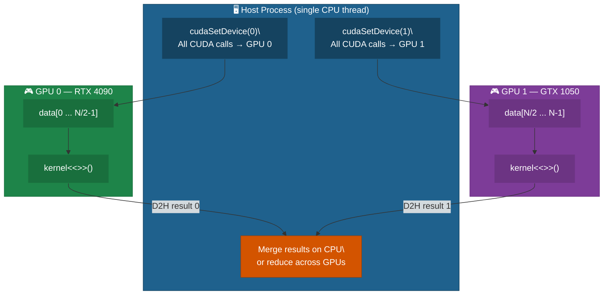
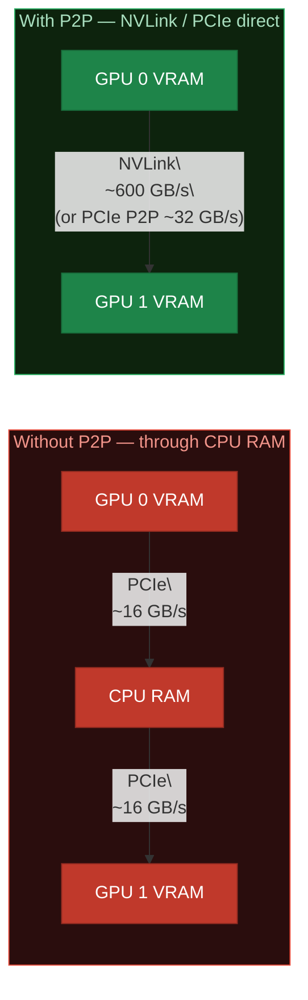
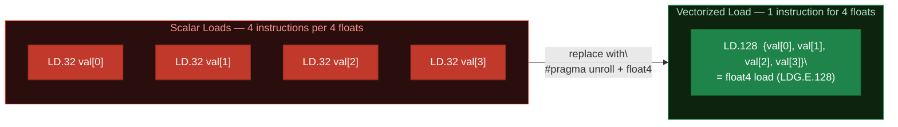
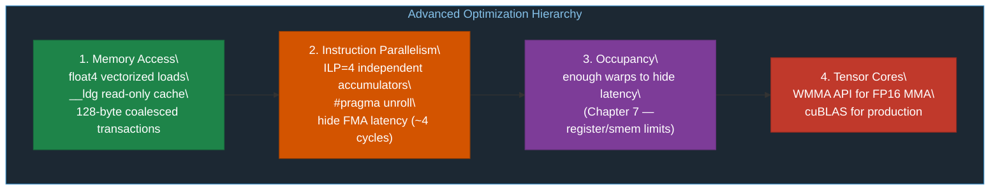
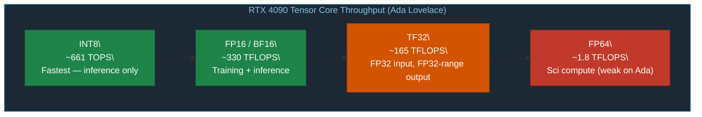
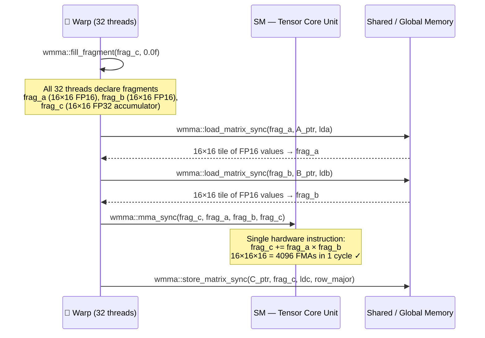
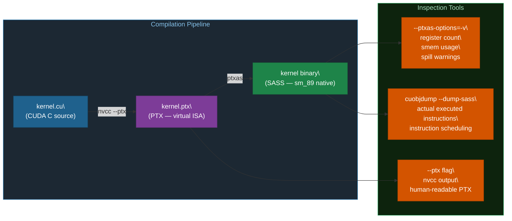

# Chapter 12: Multi-GPU Programming and Advanced Optimization

## 12.1 Multi-GPU Basics

Modern workstations and servers have multiple GPUs. CUDA supports programming across all of them from a single host process.



```c
int deviceCount;
cudaGetDeviceCount(&deviceCount);   // How many GPUs?

// Select GPU for current thread
cudaSetDevice(0);   // All subsequent CUDA calls go to GPU 0
cudaSetDevice(1);   // Now GPU 1

// Check which GPU is current
int current;
cudaGetDevice(&current);
```

Time ≈ single-GPU time / N_gpus (ideal — actual depends on transfer overhead).

## 12.2 Peer-to-Peer (P2P) Access

Without P2P, GPU-to-GPU copies must detour through CPU RAM. With P2P (NVLink or same PCIe switch), GPUs exchange data directly:



```c
// Check if GPU 0 can access GPU 1's memory
int canAccess;
cudaDeviceCanAccessPeer(&canAccess, 0, 1);  // from 0 to 1
if (canAccess) {
    cudaSetDevice(0);
    cudaDeviceEnablePeerAccess(1, 0);  // Enable P2P from GPU 0 to GPU 1
    // Now GPU 0 kernels can directly read/write GPU 1 memory
}
```

> Your system has RTX 4090 + GTX 1050 on different PCIe slots without NVLink — P2P via PCIe may or may not be supported. Check with `01_multi_gpu.cu`.

## 12.3 Advanced Optimization Techniques

### Vectorized Memory Loads (float4)

Instead of loading one float per instruction, load 4 floats at once in a single 128-bit transaction:

```diff
  Scalar load — 1 float (32 bits) per instruction:

- float val = data[i];
- // 1 thread × 4 bytes = 4 bytes per load instruction
- // 32 threads × 4 bytes = 128 bytes per warp transaction  (fine, but 4 instructions)

  Vectorized load — 4 floats (128 bits) per instruction:

+ float4 val4 = reinterpret_cast<float4*>(data)[i];
+ float a = val4.x, b = val4.y, c = val4.z, d = val4.w;
+ // 1 thread × 16 bytes = 16 bytes per load instruction
+ // 32 threads × 16 bytes = 512 bytes per warp transaction (4x throughput) ✓
+ // Requirement: array must be 16-byte aligned, size divisible by 4
```



### `__ldg()` — Read-Only Cache

```diff
  Standard global load — goes through L1/L2 cache:

- float val = data[i];
- // Pollutes L1 cache with data that is never written back
- // Sub-optimal for read-only arrays accessed in irregular patterns

  Read-only cache load — uses the texture cache path:

+ float val = __ldg(&data[i]);
+ // Separate texture/read-only cache — doesn't pollute L1
+ // Better for non-coalesced read-only data (e.g., lookup tables, weights)

+ // Or: compiler auto-uses __ldg when pointer is marked __restrict__:
+ __global__ void kernel(const float* __restrict__ data, ...) { ... }
```

### Instruction-Level Parallelism (ILP)

Each thread computes multiple independent values, letting the GPU pipeline hide instruction latency:

```diff
  ILP=1 — single accumulator, sequential dependency chain:

- for (int i = tid; i < n; i += stride)
-     sum += data[i];           // Each iteration waits for previous add to complete
- // Pipeline stalls every iteration — latency not hidden ✗

  ILP=4 — four independent accumulators, fully pipelined:

+ float s0 = 0, s1 = 0, s2 = 0, s3 = 0;
+ for (int i = tid; i < n; i += stride * 4) {
+     s0 += data[i + 0*stride];   // Independent — can issue all 4 in parallel ✓
+     s1 += data[i + 1*stride];
+     s2 += data[i + 2*stride];
+     s3 += data[i + 3*stride];
+ }
+ float sum = s0 + s1 + s2 + s3;
```

### Loop Unrolling

```c
// Manual unroll — 4 iterations emitted as straight-line code
#pragma unroll 4
for (int k = 0; k < TILE; k++)
    acc += As[ty][k] * Bs[k][tx];

// Full unroll (TILE must be compile-time constant)
#pragma unroll
for (int k = 0; k < TILE; k++)
    acc += As[ty][k] * Bs[k][tx];
```



## 12.4 Tensor Cores (WMMA API)

Tensor Cores execute a full 16×16×16 matrix multiply-accumulate (MMA) in a **single warp-level instruction** — the entire warp cooperates:





```c
#include <mma.h>
using namespace nvcuda;

// Fragment declarations (16x16x16 tile)
wmma::fragment<wmma::matrix_a, 16, 16, 16, half, wmma::row_major>    frag_a;
wmma::fragment<wmma::matrix_b, 16, 16, 16, half, wmma::col_major>    frag_b;
wmma::fragment<wmma::accumulator, 16, 16, 16, float>                  frag_c;

// Initialize accumulator to zero
wmma::fill_fragment(frag_c, 0.0f);

// Load 16x16 tiles from global/shared memory
wmma::load_matrix_sync(frag_a, A_ptr, leading_dim);
wmma::load_matrix_sync(frag_b, B_ptr, leading_dim);

// Execute MMA: frag_c += frag_a * frag_b (one hardware instruction for the whole warp!)
wmma::mma_sync(frag_c, frag_a, frag_b, frag_c);

// Store result
wmma::store_matrix_sync(C_ptr, frag_c, leading_dim, wmma::mem_row_major);
```

> **Note**: WMMA is a warp-level API — all 32 threads in the warp must call these functions together. For production: use cuBLAS (already exploits Tensor Cores with auto-tuning).

## 12.5 Checking PTX and Register Usage

```bash
# Compile with register usage report
nvcc -arch=sm_89 -O2 --ptxas-options=-v -o kernel kernel.cu
# Output: ptxas info: Function 'myKernel': 32 registers, 512 bytes smem, ...

# Inspect PTX assembly (virtual ISA)
nvcc -arch=sm_89 -O2 --ptx -o kernel.ptx kernel.cu

# Inspect SASS (actual GPU binary assembly)
cuobjdump --dump-sass kernel
```



## 12.6 Course Summary — What You've Learned

```mermaid
graph TD
    subgraph FOUNDATIONS["Foundations (Ch 01–04)"]
        C1["Ch 01: GPU Architecture\\nSMs, warps, SIMT, memory hierarchy"]
        C2["Ch 02: Kernels & Thread Indexing\\ngridDim, blockIdx, threadIdx, grid-stride"]
        C3["Ch 03: Memory Optimization\\ncoalescing, shared mem, bank conflicts"]
        C4["Ch 04: Tiled GEMM\\narithmetic intensity, roofline, cooperative load"]
    end

    subgraph INTERMEDIATE["Intermediate (Ch 05–08)"]
        C5["Ch 05: Parallel Reduction\\ntree reduction, warp shuffle, atomics"]
        C6["Ch 06: Streams & Concurrency\\nasync transfers, pinned memory, pipelines"]
        C7["Ch 07: Profiling\\nNsight, CUDA events, occupancy, Little's Law"]
        C8["Ch 08: Unified Memory\\npage migration, prefetch, zero-copy"]
    end

    subgraph ADVANCED["Advanced (Ch 09–12)"]
        C9["Ch 09: Warp Primitives\\nshuffle, ballot, vote, cooperative groups"]
        C10["Ch 10: CUDA Libraries\\ncuBLAS, Thrust, cuRAND, cuFFT"]
        C11["Ch 11: Python CUDA\\nPyTorch, CuPy, RawKernel, AMP"]
        C12["Ch 12: Multi-GPU + Opt\\nP2P, float4, ILP, Tensor Cores (WMMA)"]
    end

    FOUNDATIONS --> INTERMEDIATE --> ADVANCED

    style FOUNDATIONS  fill:#1f618d,color:#fff,stroke:#154360
    style INTERMEDIATE fill:#7d3c98,color:#fff,stroke:#6c3483
    style ADVANCED     fill:#1e8449,color:#fff,stroke:#196f3d
    style C1  fill:#154360,color:#aed6f1,stroke:#1f618d
    style C2  fill:#154360,color:#aed6f1,stroke:#1f618d
    style C3  fill:#154360,color:#aed6f1,stroke:#1f618d
    style C4  fill:#154360,color:#aed6f1,stroke:#1f618d
    style C5  fill:#6c3483,color:#d7bde2,stroke:#7d3c98
    style C6  fill:#6c3483,color:#d7bde2,stroke:#7d3c98
    style C7  fill:#6c3483,color:#d7bde2,stroke:#7d3c98
    style C8  fill:#6c3483,color:#d7bde2,stroke:#7d3c98
    style C9  fill:#196f3d,color:#a9dfbf,stroke:#1e8449
    style C10 fill:#196f3d,color:#a9dfbf,stroke:#1e8449
    style C11 fill:#196f3d,color:#a9dfbf,stroke:#1e8449
    style C12 fill:#196f3d,color:#a9dfbf,stroke:#1e8449
```



## 12.7 Exercises

1. Run `01_multi_gpu.cu` and measure the speedup of dual-GPU vs single-GPU vector add. Is it close to 2x?
2. In `02_vectorized_loads.cu`, verify the float4 and scalar results match. What happens if the array size is not a multiple of 4?
3. Run `03_tensor_cores.cu` and compare FP16 WMMA GFLOPS to FP32 CUDA core GFLOPS. How close to the 4x theoretical speedup do you get?
4. Profile `03_tensor_cores.cu` with `ncu`. Check the "SM Throughput" and "Tensor Active" metrics.
5. Implement a batched WMMA GEMM that processes 16 independent 16×16×16 matrix multiplications in a single kernel.

## 12.8 Key Takeaways

- `cudaSetDevice(n)` selects the active GPU for the current host thread — the simplest multi-GPU model.
- Multi-GPU scaling: split data, launch kernels on each GPU, merge results — near-linear for compute-bound work.
- P2P (NVLink / PCIe direct) eliminates the CPU RAM detour for GPU-to-GPU transfers.
- `float4` vectorized loads reduce instruction count and naturally align to 128-bit memory transactions.
- ILP=4 with independent accumulators lets the GPU pipeline hide instruction latency across iterations.
- WMMA is a **warp-level** API — all 32 threads must call it together; prefer cuBLAS for production.
- For production: use cuBLAS (already exploits Tensor Cores with auto-tuning) rather than raw WMMA.
